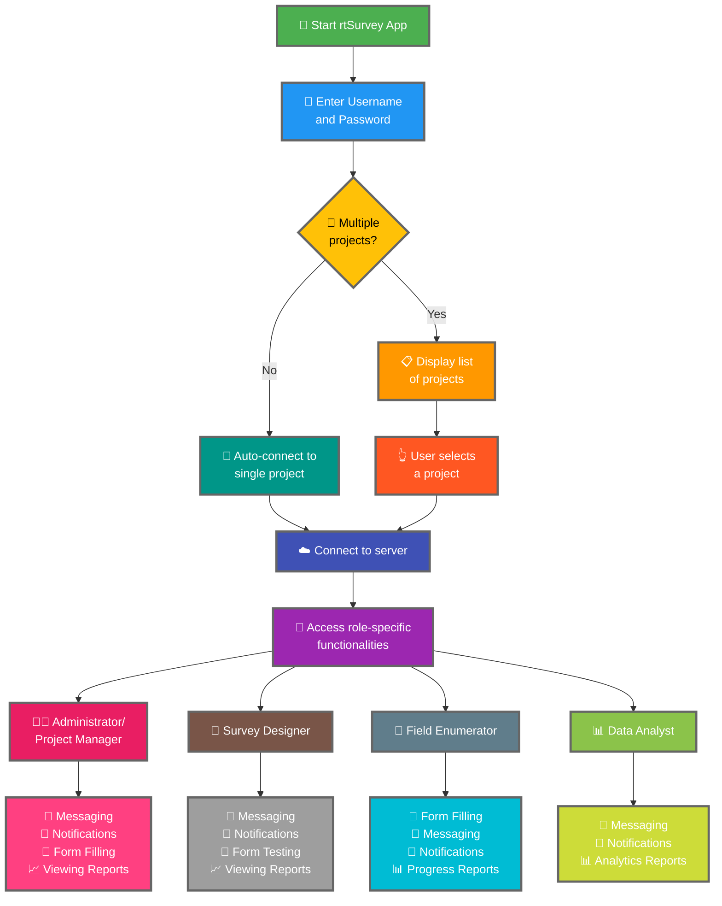

يُعدّ ربط تطبيق rtSurvey بخادم خطوة أساسية لبدء استخدام التطبيق لجمع البيانات وإدارتها وتحليلها. تضمن هذه العملية أن جميع أدوار الاستطلاع يمكنها الوصول إلى الوظائف والبيانات اللازمة في الوقت الفعلي.

## الاختلافات الرئيسية عن ODK Collect

يقدم rtSurvey وظائف محسّنة مقارنةً بـ ODK Collect، تلبي احتياجات أدوار الاستطلاع المختلفة:
- **المسؤول**: المراسلة والإشعارات بالتحديثات (إرسال البيانات، التقارير الجديدة، الحسابات الجديدة) وملء النماذج وعرض تقارير التحليل.
- **مدير المشروع**: وظائف مماثلة للمسؤولين، بما في ذلك إعداد المشاريع وإدارتها.
- **مصمّم الاستطلاع**: المراسلة والإشعارات وملء النماذج وعرض تقارير التحليل.
- **المعدِّد الميداني**: ملء النماذج والمراسلة والإشعارات وتقارير التقدم.
- **محلل البيانات**: المراسلة والإشعارات والوصول إلى تقارير التحليلات.

## خطوات ربط تطبيق rtSurvey بخادم

### 1. تأكد من وجود حساب

للاتصال بالخادم، تحتاج إلى حساب. يمكن إنشاء الحسابات من قِبَل مسؤول أو من قِبَل الكوادر باستخدام رابط إنشاء حساب يُعدّه المسؤول.

### 2. افتح تطبيق rtSurvey

شغّل تطبيق rtSurvey على جهازك المحمول. إذا لم تكن قد ثبّته بعد، راجع صفحة [تثبيت تطبيق rtSurvey](#installing-rtsurvey-app).

### 3. الوصول إلى إعدادات الاتصال بالخادم

1. افتح التطبيق وانتقل إلى قائمة الإعدادات.
2. اختر خيار الاتصال بخادم.

### 4. إدخال بيانات الحساب واختيار المشروع

عند الاتصال بـ rtSurvey، تُبسَّط العملية بناءً على إعداد حسابك:

- **اسم المستخدم**: أدخل اسم مستخدم حسابك.
- **كلمة المرور**: أدخل كلمة مرور حسابك.

بعد إدخال بياناتك:

- إذا كان حسابك مرتبطاً بمشروع استطلاع واحد فقط:
  - سيُسجّل التطبيق دخولك تلقائياً إلى خادم ذلك المشروع.
  - لا تحتاج إلى إدخال عنوان URL الخادم أو اختيار مشروع يدوياً.

- إذا كان حسابك مرتبطاً بمشاريع استطلاع متعددة:
  - بعد المصادقة الناجحة، ستظهر قائمة بالمشاريع التي يمكنك الوصول إليها.
  - اختر المشروع الذي تريد العمل عليه من هذه القائمة.

### 5. المصادقة

بعد إدخال تفاصيل الخادم، اضغط على زر "اتصال" أو "تسجيل الدخول". سيُصادق التطبيق على بياناتك وينشئ اتصالاً بالخادم.

## استكشاف مشكلات الاتصال

إذا واجهت مشكلات أثناء الاتصال بالخادم:

1. **تحقق من اتصال الإنترنت**: تأكد من اتصال جهازك بالإنترنت.
2. **تأكد من بيانات الاعتماد**: تأكد من صحة اسم المستخدم وكلمة المرور.
3. **أعد تشغيل التطبيق**: أغلق تطبيق rtSurvey وأعد فتحه.
4. **تواصل مع الدعم**: إذا استمرت المشكلات، تواصل مع مسؤول النظام أو دعم rtSurvey للمساعدة.

## الخلاصة

ربط تطبيق rtSurvey بخادم هو عملية مباشرة تُتيح لك الاستفادة من الإمكانات الكاملة للتطبيق. باتباع الخطوات الموضحة أعلاه، يمكنك ضمان جمع البيانات وإدارتها وتحليلها بسلاسة وفقاً لدورك المحدد في الاستطلاع.
