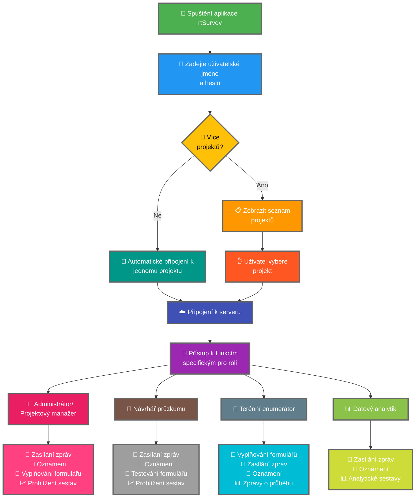

Připojení aplikace rtSurvey k serveru je klíčovým krokem pro zahájení používání aplikace pro sběr dat, správu a analýzu. Tento proces zajišťuje, že všechny průzkumné role mohou přistupovat k nezbytným funkcím a datům v reálném čase.

## Klíčové rozdíly od ODK Collect

rtSurvey nabízí vylepšené funkce oproti ODK Collect pro různé průzkumné role:
- **Administrátor**: Zasílání zpráv, oznámení pro aktualizace (odevzdání dat, nové sestavy, nové účty), vyplňování formulářů a prohlížení analytických sestav.
- **Projektový manažer**: Podobné funkce jako administrátoři, včetně nastavení a správy projektů.
- **Návrhář průzkumu**: Zasílání zpráv, oznámení, vyplňování formulářů a prohlížení analytických sestav.
- **Terénní enumerátor**: Vyplňování formulářů, zasílání zpráv, oznámení a zprávy o průběhu.
- **Datový analytik**: Zasílání zpráv, oznámení a přístup k analytickým sestavám.

## Kroky pro připojení aplikace rtSurvey k serveru

### 1. Ujistěte se, že máte účet

Pro připojení k serveru potřebujete účet. Účty může vytvořit administrátor nebo zaměstnanci pomocí URL pro vytvoření účtu nastavené administrátorem.

### 2. Otevřete aplikaci rtSurvey

Spusťte aplikaci rtSurvey na svém mobilním zařízení. Pokud jste ji ještě nenainstalovali, přejděte na stránku [Instalace aplikace rtSurvey](#installing-rtsurvey-app).

### 3. Přístup k nastavení připojení k serveru

1. Otevřete aplikaci a přejděte do nabídky nastavení.
2. Vyberte možnost připojení k serveru.

### 4. Zadejte údaje účtu a vyberte projekt

Při připojování k rtSurvey je proces zjednodušen na základě konfigurace vašeho účtu:

- **Uživatelské jméno**: Zadejte uživatelské jméno svého účtu.
- **Heslo**: Zadejte heslo svého účtu.

Po zadání přihlašovacích údajů:

- Pokud je váš účet přidružen k pouze jednomu průzkumnému projektu:
  - Aplikace vás automaticky přihlásí na server tohoto projektu.
  - Nemusíte zadávat URL serveru nebo ručně vybírat projekt.

- Pokud je váš účet přidružen k více průzkumným projektům:
  - Po úspěšném ověření uvidíte seznam projektů, ke kterým máte přístup.
  - Ze seznamu vyberte projekt, na kterém chcete pracovat.

### 5. Ověřte se

Po zadání údajů serveru klepněte na tlačítko „Připojit" nebo „Přihlásit". Aplikace ověří vaše přihlašovací údaje a naváže připojení k serveru.

## Řešení problémů s připojením

Pokud narazíte na problémy při připojování k serveru:

1. **Zkontrolujte připojení k internetu**: Ujistěte se, že zařízení je připojeno k internetu.
2. **Ověřte přihlašovací údaje**: Ujistěte se, že uživatelské jméno a heslo jsou správné.
3. **Restartujte aplikaci**: Zavřete a znovu otevřete aplikaci rtSurvey.
4. **Kontaktujte podporu**: Pokud problémy přetrvávají, kontaktujte správce systému nebo podporu rtSurvey.

## Závěr

Připojení aplikace rtSurvey k serveru je přímočarý proces, který vám umožní využít plné schopnosti aplikace. Dodržením výše uvedených kroků zajistíte bezproblémový sběr dat, správu a analýzu přizpůsobenou vaší konkrétní průzkumné roli.
