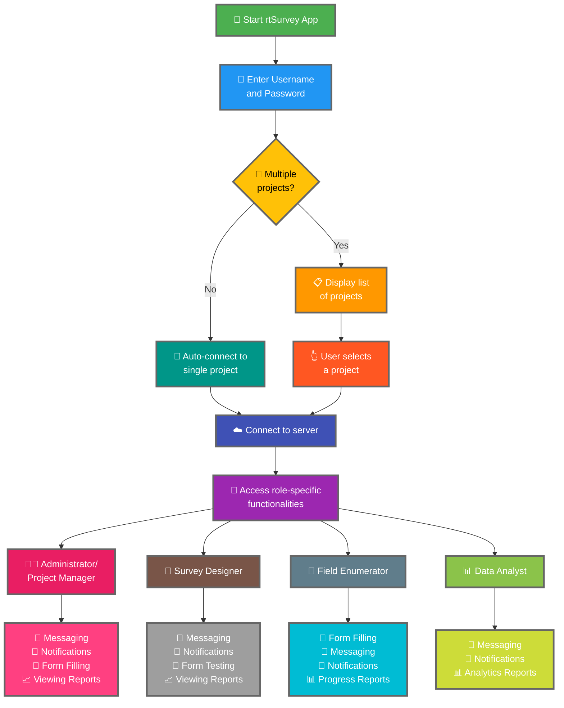

Die Verbindung der rtSurvey-App mit einem Server ist ein entscheidender Schritt, um die App für die Datenerfassung, -verwaltung und -analyse zu nutzen. Dieser Prozess stellt sicher, dass alle Umfragerollen in Echtzeit auf die erforderlichen Funktionen und Daten zugreifen können.

## Hauptunterschiede zu ODK Collect

rtSurvey bietet im Vergleich zu ODK Collect erweiterte Funktionen, die auf verschiedene Umfragerollen zugeschnitten sind:
- **Administrator**: Messaging, Benachrichtigungen über Updates (Datenübermittlung, neue Berichte, neue Konten), Ausfüllen von Formularen und Anzeigen von Analyseberichten.
- **Projektmanager**: Ähnliche Funktionen wie Administratoren, einschließlich Projektsetup und -verwaltung.
- **Survey Designer**: Messaging, Benachrichtigungen, Ausfüllen von Formularen und Anzeige von Analyseberichten.
- **Enumerator (Außendienst)**: Ausfüllen von Formularen, Messaging, Benachrichtigungen und Fortschrittsberichte.
- **Datenanalyst**: Messaging, Benachrichtigungen und Zugriff auf Analyseberichte.

## Schritte zur Verbindung der rtSurvey-App mit einem Server

### 1. Sicherstellen, dass Sie ein Konto haben

Um eine Verbindung zum Server herzustellen, benötigen Sie ein Konto. Konten können von einem Administrator oder von Mitarbeitern über eine vom Administrator eingerichtete URL zur Kontoerstellung angelegt werden.

### 2. rtSurvey-App öffnen

Starten Sie die rtSurvey-App auf Ihrem mobilen Gerät. Falls Sie diese noch nicht installiert haben, lesen Sie die Seite [rtSurvey installieren](#installing-rtsurvey-app).

### 3. Zugriff auf die Server-Verbindungseinstellungen

1. Öffnen Sie die App und navigieren Sie zum Einstellungsmenü.
2. Wählen Sie die Option zur Verbindung mit einem Server.

### 4. Kontodaten eingeben und Projekt auswählen

Bei der Verbindung mit rtSurvey ist der Prozess basierend auf Ihrer Kontokonfiguration optimiert:

- **Benutzername**: Geben Sie Ihren Benutzernamen ein.
- **Passwort**: Geben Sie Ihr Passwort ein.

Nach der Eingabe Ihrer Zugangsdaten:

- Falls Ihr Konto nur mit einem Umfrageprojekt verknüpft ist:
  - Die App meldet Sie automatisch am Server dieses Projekts an.
  - Sie müssen keine Server-URL eingeben oder manuell ein Projekt auswählen.

- Falls Ihr Konto mit mehreren Umfrageprojekten verknüpft ist:
  - Nach erfolgreicher Authentifizierung wird eine Liste der Projekte angezeigt, auf die Sie Zugriff haben.
  - Wählen Sie das Projekt aus der Liste aus, an dem Sie arbeiten möchten.

### 5. Authentifizieren

Nachdem Sie die Serverdetails eingegeben haben, tippen Sie auf die Schaltfläche "Verbinden" oder "Anmelden". Die App authentifiziert Ihre Anmeldedaten und stellt eine Verbindung zum Server her.

## Fehlerbehebung bei Verbindungsproblemen

Falls Probleme beim Verbinden mit dem Server auftreten:

1. **Internetverbindung prüfen**: Stellen Sie sicher, dass Ihr Gerät mit dem Internet verbunden ist.
2. **Zugangsdaten bestätigen**: Überprüfen Sie, ob Benutzername und Passwort korrekt sind.
3. **App neu starten**: Schließen Sie die rtSurvey-App und öffnen Sie sie erneut.
4. **Support kontaktieren**: Falls die Probleme weiterhin bestehen, kontaktieren Sie Ihren Systemadministrator oder den rtSurvey-Support.

## Fazit

Die Verbindung der rtSurvey-App mit einem Server ist ein unkomplizierter Prozess, der es Ihnen ermöglicht, die vollen Funktionen der App zu nutzen. Durch Befolgen der oben genannten Schritte können Sie eine nahtlose Datenerfassung, -verwaltung und -analyse sicherstellen, die auf Ihre spezifische Umfragerolle zugeschnitten ist.
