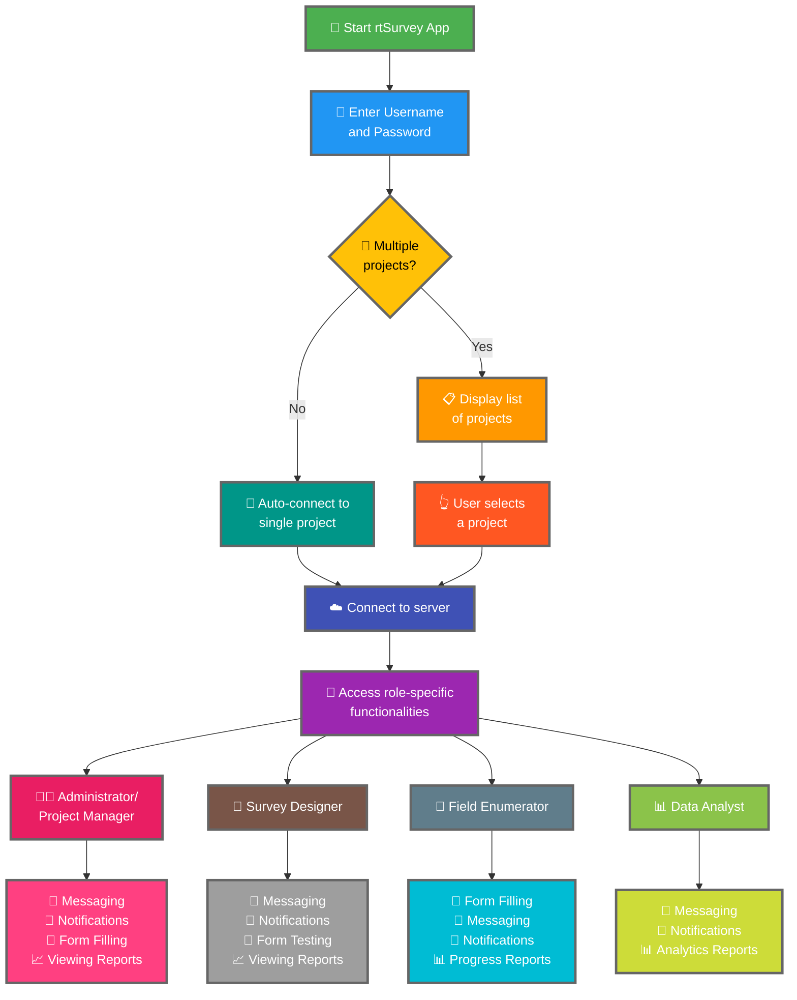

Connecter l'application rtSurvey à un serveur est une étape cruciale pour commencer à utiliser l'application pour la collecte, la gestion et l'analyse des données. Ce processus garantit que tous les rôles d'enquête peuvent accéder aux fonctionnalités et aux données nécessaires en temps réel.

## Différences Clés par rapport à ODK Collect

rtSurvey offre des fonctionnalités améliorées par rapport à ODK Collect, adaptées aux différents rôles d'enquête :
- **Administrateur** : Messagerie, notifications de mises à jour (soumission de données, nouveaux rapports, nouveaux comptes), remplissage de formulaires et consultation des rapports d'analyse.
- **Chef de Projet** : Fonctionnalités similaires aux Administrateurs, y compris la configuration et la gestion des projets.
- **Survey Designer** : Messagerie, notifications, remplissage de formulaires et consultation des rapports d'analyse.
- **Enquêteur de Terrain** : Remplissage de formulaires, messagerie, notifications et rapports d'avancement.
- **Analyste de Données** : Messagerie, notifications et accès aux rapports analytiques.

## Étapes pour Connecter l'App rtSurvey à un Serveur

### 1. Assurez-vous d'avoir un compte

Pour vous connecter au serveur, vous avez besoin d'un compte. Les comptes peuvent être créés par un Administrateur ou par le personnel via une URL de création de compte configurée par l'Administrateur.

### 2. Ouvrez l'App rtSurvey

Lancez l'application rtSurvey sur votre appareil mobile. Si vous ne l'avez pas encore installée, reportez-vous à la page [Installation de rtSurvey](#installing-rtsurvey-app).

### 3. Accédez aux Paramètres de Connexion au Serveur

1. Ouvrez l'application et accédez au menu des paramètres.
2. Sélectionnez l'option pour vous connecter à un serveur.

### 4. Entrez les Détails du Compte et Sélectionnez le Projet

Lors de la connexion à rtSurvey, le processus est simplifié en fonction de la configuration de votre compte :

- **Nom d'utilisateur** : Entrez votre nom d'utilisateur.
- **Mot de passe** : Entrez votre mot de passe.

Après avoir saisi vos identifiants :

- Si votre compte est associé à un seul projet d'enquête :
  - L'application vous connectera automatiquement au serveur de ce projet.
  - Vous n'avez pas besoin de saisir une URL de serveur ou de sélectionner un projet manuellement.

- Si votre compte est associé à plusieurs projets d'enquête :
  - Après une authentification réussie, vous verrez une liste des projets auxquels vous avez accès.
  - Sélectionnez le projet sur lequel vous souhaitez travailler dans cette liste.

### 5. Authentification

Après avoir entré les détails du serveur, appuyez sur le bouton "Connexion". L'application authentifiera vos identifiants et établira une connexion au serveur.

## Dépannage des Problèmes de Connexion

Si vous rencontrez des problèmes lors de la connexion au serveur :

1. **Vérifiez la Connexion Internet** : Assurez-vous que votre appareil est connecté à Internet.
2. **Confirmez les Identifiants** : Vérifiez que votre nom d'utilisateur et votre mot de passe sont corrects.
3. **Redémarrez l'App** : Fermez et rouvrez l'application rtSurvey.
4. **Contactez l'Assistance** : Si les problèmes persistent, contactez votre administrateur système ou le support rtSurvey.

## Conclusion

Connecter l'application rtSurvey à un serveur est un processus simple qui vous permet de tirer pleinement parti des capacités de l'application. En suivant les étapes décrites ci-dessus, vous pouvez garantir une collecte, une gestion et une analyse des données fluides et adaptées à votre rôle spécifique dans l'enquête.
