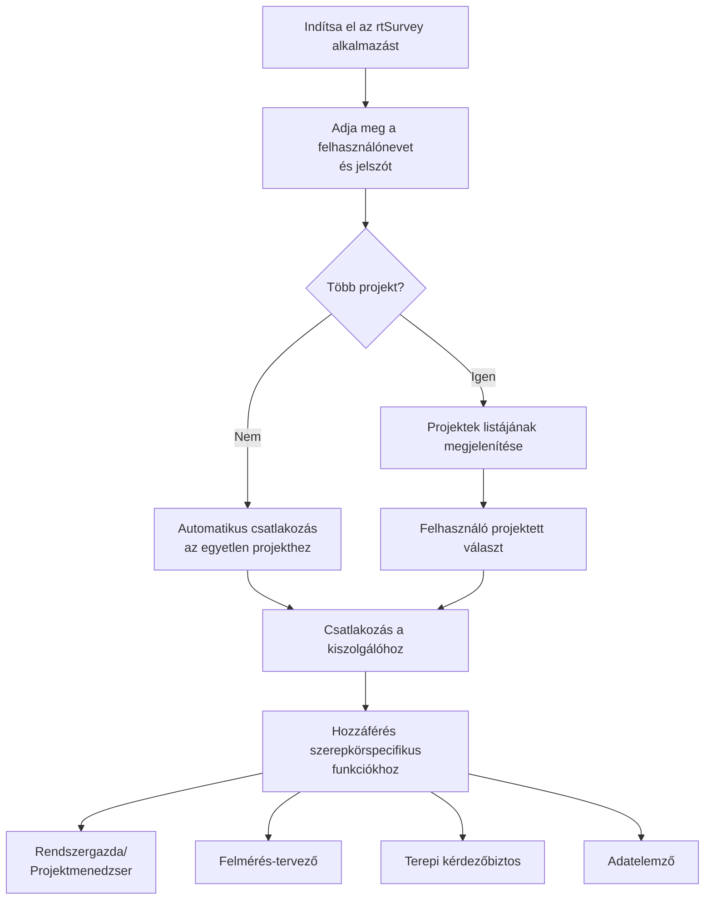

Az rtSurvey alkalmazás kiszolgálóhoz való csatlakoztatása alapvető lépés az alkalmazás adatgyűjtési, -kezelési és -elemzési célokra való használatának megkezdéséhez. Ez a folyamat biztosítja, hogy minden felmérési szerepkör valós időben hozzáférhessen a szükséges funkciókhoz és adatokhoz.

## Főbb különbségek az ODK Collect-hez képest

Az rtSurvey fokozott funkcionalitást kínál az ODK Collecthez képest, különböző felmérési szerepkörök kiszolgálásával:
- **Rendszergazda**: Üzenetküldés, értesítések frissítésekről (adatbeküldés, új jelentések, új fiókok), űrlapkitöltés és elemzési jelentések megtekintése.
- **Projektmenedzser**: Hasonló funkciók, mint a rendszergazdáknál, beleértve a projekt beállítását és kezelését.
- **Felmérés-tervező**: Üzenetküldés, értesítések, űrlapkitöltés és elemzési jelentések megtekintése.
- **Terepi kérdezőbiztos**: Űrlapkitöltés, üzenetküldés, értesítések és haladási jelentések.
- **Adatelemző**: Üzenetküldés, értesítések és hozzáférés az elemzési jelentésekhez.

## Az rtSurvey alkalmazás kiszolgálóhoz való csatlakoztatásának lépései

### 1. Győződjön meg arról, hogy rendelkezik fiókkal

A kiszolgálóhoz való csatlakozáshoz fiókra van szüksége. A fiókokat egy rendszergazda hozhatja létre, vagy a munkatársak használhatnak egy rendszergazda által beállított fióklétrehozási URL-t.

### 2. Nyissa meg az rtSurvey alkalmazást

Indítsa el az rtSurvey alkalmazást mobileszközén. Ha még nem telepítette, tekintse meg az [rtSurvey alkalmazás telepítése](#installing-rtsurvey-app) oldalt.

### 3. Érje el a kiszolgáló kapcsolati beállításait

1. Nyissa meg az alkalmazást, és navigáljon a beállítások menübe.
2. Válassza a kiszolgálóhoz való csatlakozás lehetőséget.

### 4. Adja meg a fiók adatait, és válasszon projektet

Az rtSurvey-hez való csatlakozáskor a folyamat az ön fiókjának konfigurációja alapján egyszerűsödik:

- **Felhasználónév**: Adja meg fiókjának felhasználónevét.
- **Jelszó**: Adja meg fiókjának jelszavát.

A hitelesítő adatok megadása után:

- Ha fiókja csak egy felmérési projekthez van társítva:
  - Az alkalmazás automatikusan bejelentkezteti Önt a projekt kiszolgálójára.
  - Nem kell kiszolgáló URL-t megadnia vagy manuálisan projektet kiválasztania.

- Ha fiókja több felmérési projekthez van társítva:
  - A sikeres hitelesítés után megjelenik az Ön által elérhető projektek listája.
  - Válassza ki a listából azt a projektet, amelyen dolgozni szeretne.

### 5. Hitelesítés

A kiszolgáló adatainak megadása után koppintson a „Csatlakozás" vagy „Bejelentkezés" gombra. Az alkalmazás hitelesíti hitelesítő adatait, és létrehozza a kapcsolatot a kiszolgálóval.

## Csatlakozási problémák hibaelhárítása

Ha problémákba ütközik a kiszolgálóhoz való csatlakozáskor:

1. **Internetkapcsolat ellenőrzése**: Győződjön meg arról, hogy eszköze csatlakozik az internethez.
2. **Hitelesítő adatok megerősítése**: Győződjön meg arról, hogy felhasználóneve és jelszava helyes.
3. **Az alkalmazás újraindítása**: Zárja be és nyissa meg újra az rtSurvey alkalmazást.
4. **Kapcsolatfelvétel az ügyfélszolgálattal**: Ha a problémák fennmaradnak, forduljon rendszergazdájához vagy az rtSurvey ügyfélszolgálatához segítségért.

## Összefoglalás

Az rtSurvey alkalmazás kiszolgálóhoz való csatlakoztatása egy egyszerű folyamat, amely lehetővé teszi az alkalmazás teljes képességeinek kihasználását. A fent vázolt lépések követésével biztosíthatja a zökkenőmentes adatgyűjtést, -kezelést és -elemzést, amelyek az Ön felmérési szerepköréhez igazodnak.
