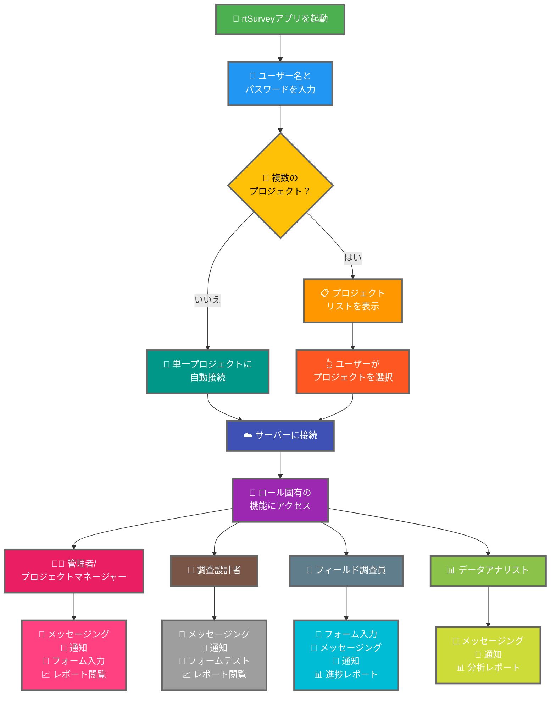

rtSurveyアプリをサーバーに接続することは、データ収集、管理、分析にアプリを使用し始めるための重要なステップです。このプロセスにより、すべての調査ロールがリアルタイムで必要な機能とデータにアクセスできるようになります。

## ODK Collectとの主な違い

rtSurveyはODK Collectと比べてさまざまな調査ロールに対応した強化された機能を提供します：
- **管理者**：メッセージング、更新通知（データ送信、新しいレポート、新しいアカウント）、フォーム入力、分析レポートの閲覧。
- **プロジェクトマネージャー**：管理者と同様の機能（プロジェクトの設定と管理を含む）。
- **調査設計者**：メッセージング、通知、フォーム入力、分析レポートの閲覧。
- **フィールド調査員**：フォーム入力、メッセージング、通知、進捗レポート。
- **データアナリスト**：メッセージング、通知、分析レポートへのアクセス。

## rtSurveyアプリをサーバーに接続する手順

### 1. アカウントを持っていることを確認する

サーバーに接続するにはアカウントが必要です。アカウントは管理者が作成するか、管理者が設定したアカウント作成URLを使ってスタッフが作成できます。

### 2. rtSurveyアプリを開く

モバイルデバイスでrtSurveyアプリを起動します。まだインストールしていない場合は、[rtSurveyアプリのインストール](#installing-rtsurvey-app)ページを参照してください。

### 3. サーバー接続設定にアクセスする

1. アプリを開いて設定メニューに移動する。
2. サーバーへの接続オプションを選択する。

### 4. アカウント詳細を入力してプロジェクトを選択する

rtSurveyに接続する際、プロセスはアカウントの設定に基づいて効率化されています：

- **ユーザー名**：アカウントのユーザー名を入力する。
- **パスワード**：アカウントのパスワードを入力する。

認証情報を入力した後：

- アカウントが1つの調査プロジェクトのみに関連付けられている場合：
  - アプリはそのプロジェクトのサーバーに自動的にサインインします。
  - サーバーURLを入力したりプロジェクトを手動で選択する必要はありません。

- アカウントが複数の調査プロジェクトに関連付けられている場合：
  - 認証が成功した後、アクセス権のあるプロジェクトのリストが表示されます。
  - リストから作業するプロジェクトを選択してください。

### 5. 認証する

サーバーの詳細を入力した後、「接続」または「ログイン」ボタンをタップします。アプリが認証情報を認証してサーバーとの接続を確立します。

## 接続問題のトラブルシューティング

サーバーへの接続中に問題が発生した場合：

1. **インターネット接続を確認する**：デバイスがインターネットに接続されていることを確認する。
2. **認証情報を確認する**：ユーザー名とパスワードが正しいことを確認する。
3. **アプリを再起動する**：rtSurveyアプリを閉じて再度開く。
4. **サポートに連絡する**：問題が解決しない場合は、システム管理者またはrtSurveyサポートに連絡する。

## まとめ

rtSurveyアプリをサーバーに接続することは、アプリのすべての機能を活用できるようにする簡単なプロセスです。上記の手順に従うことで、特定の調査ロールに合わせたシームレスなデータ収集、管理、分析が確実に行えます。
