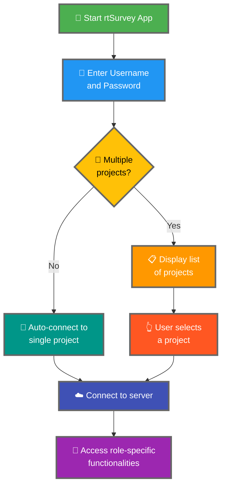

ការ ភ ្ ជ ា ប ់ rtSurvey app ទ ៅ server គ ឺ ជ ាំ ហ ា ន ចា ំ ប ា ច ់ ដើ ម ្ ប ី ចា ប ់ ផ ្ ត ើ ម ប ្ រ ើ app ស ម ្ រ ា ប ់ ប ្ រ មូ ល ទ ិ ន ្ ន ន ័ យ , ការ គ ្ រ ប ់ គ ្ រ ាំ , ហ ើ យ ការ វ ិ ភ ា គ ។

## Key Differences ពី ODK Collect

rtSurvey ផ ្ ត ល ់ functionalities ដ ែ ល ប ន ្ ថ ែ ម ប ើ ប ្ ត ូ រ ន ឹ ង ODK Collect:
- **Administrator**: Messaging, notifications, form filling, ហ ើ យ ការ ស ្ វ ែ ង មើ ល analysis reports ។
- **Project Manager**: Functionalities ស ្ រ ើ ប ស ្ ទ ើ ប ដូ ច Administrators, រួ ម ទ ា ំ ង project setup ។
- **Survey Designer**: Messaging, notifications, form filling, ហ ើ យ analysis reports ។
- **Field Enumerator**: Form filling, messaging, notifications, ហ ើ យ progress reports ។
- **Data Analyst**: Messaging, notifications, ហ ើ យ analytics reports ។

## ជំ ហ ា ន ភ ្ ជ ា ប ់ rtSurvey App ទ ៅ Server

### ១. ធ ា ន ា ថ ា អ ្ ន ក ម ា ន គ ណ ន ី

ដើ ម ្ ប ី ភ ្ ជ ា ប ់ ទ ៅ server, អ ្ ន ក ត ្ រ ូ វ ការ គ ណ ន ី ។ គ ណ ន ី អ ា ច ត ្ រ ូ វ ប ា ន ប ង ្ ក ើ ត ដ ោ យ Administrator ឬ ដ ោ យ staff ដ ោ យ ប ្ រ ើ account creation URL ។

### ២. បើ ក rtSurvey App

Launch rtSurvey app ន ៅ ល ើ mobile device ។

### ៣. ចូ ល ដ ំ ណ ើ រ ការ Server Connection Settings

1. បើ ក app ហ ើ យ navigate ទ ៅ settings menu ។
2. ជ ្ រ ើ ស ជ ំ រ ើ ស ដើ ម ្ ប ី ភ ្ ជ ា ប ់ ទ ៅ server ។

### ៤. ដ ា ក ់ បញ ្ ចូ ល Account Details

- **Username**: ដ ា ក ់ បញ ្ ចូ ល account username ។
- **Password**: ដ ា ក ់ បញ ្ ចូ ល account password ។

ប ន ្ ទ ា ប ់ ពី ដ ា ក ់ បញ ្ ចូ ល credentials:

- ប ្ រ ស ិ ន ប ើ គ ណ ន ី ភ ្ ជ ា ប ់ ជ ា មួ យ survey project ម ួ យ ប ្ រ ើ គ ណ ន ី :#1: app ន ឹ ង ចូ ល ភ ្ លា ម ៗ ទ ៅ project server ន ោ ះ ។
- ប ្ រ ស ិ ន ប ើ គ ណ ន ី ភ ្ ជ ា ប ់ ជ ា មួ យ survey projects ច ្ រ ើ ន: ប ន ្ ទ ា ប ់ ពី authentication, អ ្ ន ក ន ឹ ង ឃ ើ ញ ប ញ ្ ជ ី projects ។

## ការ ដ ោ ះ ស ្ រ ា យ បញ ្ ហ ា Connection

1. **ពិ ន ិ ត ្ យ Internet Connection**: ធ ា ន ា ថ ា ឧ ប ករណ ់ ភ ្ ជ ា ប ់ internet ។
2. **ប ញ ្ ជ ា ក ់ Credentials**: ធ ា ន ា ថ ា username ហ ើ យ password ត ្ រ ូ វ ។
3. **Restart App**: ប ិ ទ ហ ើ យ បើ ក rtSurvey app ម ្ ត ង ទ ៀ ត ។
4. **ទ ាក ់ ទ ង Support**: ប ្ រ ស ិ ន ប ើ បញ ្ ហ ា ន ៅ ប ន ្ ត ន ៅ , ទ ាក ់ ទ ង administrator ឬ rtSurvey support ។
