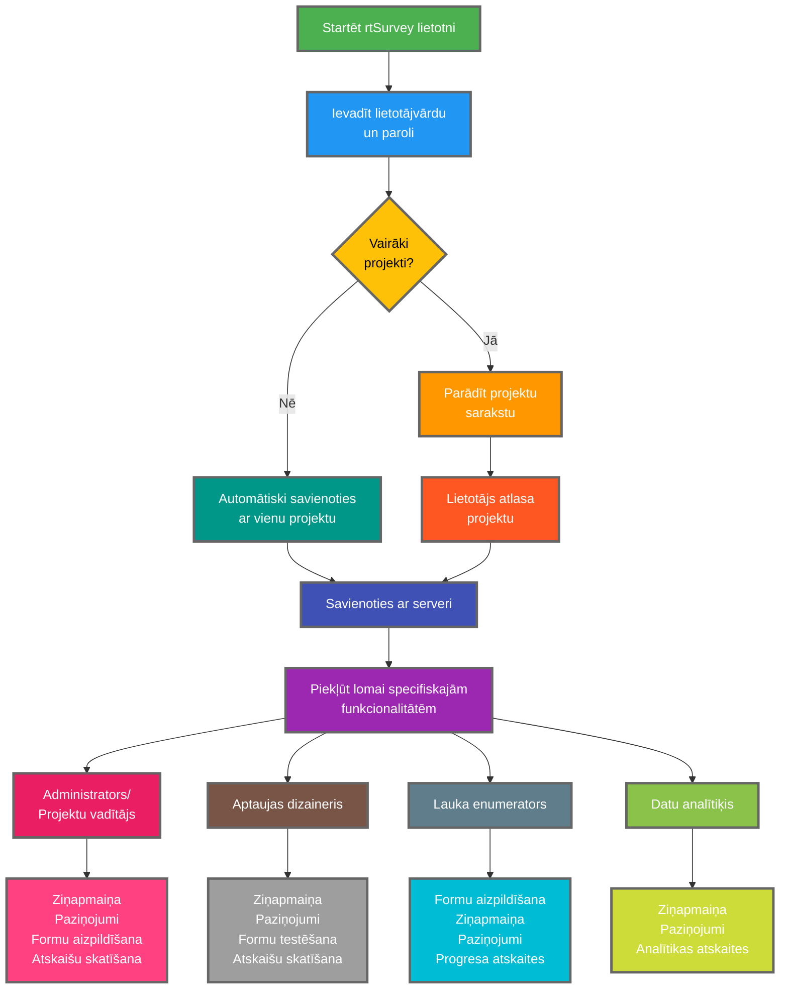

Savienošana ar rtSurvey lietotni ar serveri ir būtisks solis, lai sāktu izmantot lietotni datu vākšanai, pārvaldībai un analīzei. Šis process nodrošina, ka visas aptaujas lomas var reāllaikā piekļūt nepieciešamajām funkcionalitātēm un datiem.

## Galvenās atšķirības no ODK Collect

rtSurvey piedāvā uzlabotas funkcionalitātes salīdzinājumā ar ODK Collect, apmierinot dažādas aptaujas lomas:
- **Administrators**: Ziņapmaiņa, paziņojumi par atjauninājumiem (datu iesniegšana, jaunas atskaites, jauni konti), formu aizpildīšana un analīzes atskaišu skatīšana.
- **Projektu vadītājs**: Līdzīgas funkcionalitātes kā administratoriem, ieskaitot projektu iestatīšanu un pārvaldību.
- **Aptaujas dizaineris**: Ziņapmaiņa, paziņojumi, formu aizpildīšana un analīzes atskaišu skatīšana.
- **Lauka enumerators**: Formu aizpildīšana, ziņapmaiņa, paziņojumi un progresa atskaites.
- **Datu analītiķis**: Ziņapmaiņa, paziņojumi un piekļuve analītikas atskaitēm.

## Soļi rtSurvey lietotnes savienošanai ar serveri

### 1. Pārliecinieties, ka jums ir konts

Lai savienotos ar serveri, jums nepieciešams konts. Kontus var izveidot administrators vai darbinieki, izmantojot konta izveides URL, ko iestatījis administrators.

### 2. Atveriet rtSurvey lietotni

Palaidiet rtSurvey lietotni mobilajā ierīcē. Ja vēl neesat to instalējis, skatiet lapu [rtSurvey lietotnes instalēšana](#installing-rtsurvey-app).

### 3. Piekļūstiet servera savienojuma iestatījumiem

1. Atveriet lietotni un dodieties uz iestatījumu izvēlni.
2. Atlasiet iespēju savienoties ar serveri.

### 4. Ievadiet konta detaļas un atlasiet projektu

Savienojoties ar rtSurvey, process tiek racionalizēts, pamatojoties uz jūsu konta konfigurāciju:

- **Lietotājvārds**: Ievadiet sava konta lietotājvārdu.
- **Parole**: Ievadiet sava konta paroli.

Pēc akreditācijas datu ievadīšanas:

- Ja jūsu konts ir saistīts tikai ar vienu aptaujas projektu:
  - Lietotne automātiski piesakīsies šī projekta serverī.
  - Servera URL vai projekta manuāla atlase nav nepieciešama.

- Ja jūsu konts ir saistīts ar vairākiem aptaujas projektiem:
  - Pēc veiksmīgas autentifikācijas redzēsiet to projektu sarakstu, kuriem jums ir piekļuve.
  - Atlasiet projektu, ar kuru vēlaties strādāt, no šī saraksta.

### 5. Autentificējieties

Pēc servera detaļu ievadīšanas pieskarieties pogai "Savienot" vai "Pieteikties". Lietotne autentificēs jūsu akreditācijas datus un izveidos savienojumu ar serveri.

## Savienojuma problēmu novēršana

Ja rodas problēmas, savienojoties ar serveri:

1. **Pārbaudiet interneta savienojumu**: Pārliecinieties, ka ierīce ir savienota ar internetu.
2. **Apstipriniet akreditācijas datus**: Pārliecinieties, ka lietotājvārds un parole ir pareizi.
3. **Restartējiet lietotni**: Aizveriet un atkārtoti atveriet rtSurvey lietotni.
4. **Sazinieties ar atbalstu**: Ja problēmas saglabājas, sazinieties ar sistēmas administratoru vai rtSurvey atbalstu.

## Secinājums

Savienošana ar rtSurvey lietotni ar serveri ir vienkāršs process, kas ļauj izmantot pilnas lietotnes iespējas. Sekojot iepriekš aprakstītajiem soļiem, varat nodrošināt netraucētu datu vākšanu, pārvaldību un analīzi atbilstoši jūsu konkrētajai aptaujas lomai.
