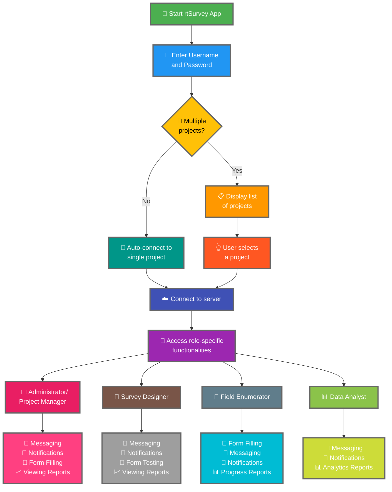

Å koble rtSurvey-appen til en server er et avgjørende trinn for å begynne å bruke appen til datainnsamling, -administrasjon og -analyse. Denne prosessen sikrer at alle undersøkelsesroller kan få tilgang til nødvendige funksjoner og data i sanntid.

## Viktige forskjeller fra ODK Collect

rtSurvey tilbyr forbedrede funksjoner sammenlignet med ODK Collect, tilpasset ulike undersøkelsesroller:
- **Administrator**: Meldinger, varsler om oppdateringer (datainnsending, nye rapporter, nye kontoer), skjemautfylling og visning av analyserapporter.
- **Prosjektleder**: Lignende funksjoner som administratorer, inkludert prosjektoppsett og -administrasjon.
- **Skjemadesigner**: Meldinger, varsler, skjemautfylling og visning av analyserapporter.
- **Feltarbeider**: Skjemautfylling, meldinger, varsler og fremdriftsrapporter.
- **Dataanalytiker**: Meldinger, varsler og tilgang til analyserapporter.

## Trinn for å koble rtSurvey-appen til en server

### 1. Kontroller at du har en konto

For å koble til serveren trenger du en konto. Kontoer kan opprettes av en administrator eller av ansatte ved hjelp av en kontoopp­rettings-URL satt opp av administratoren.

### 2. Åpne rtSurvey-appen

Start rtSurvey-appen på mobilenheten din. Hvis du ikke har installert den ennå, se siden [Installere rtSurvey](#installing-rtsurvey-app).

### 3. Åpne servertilkoblingsinnstillingene

1. Åpne appen og naviger til innstillingsmenyen.
2. Velg alternativet for å koble til en server.

### 4. Skriv inn kontodetaljer og velg prosjekt

Når du kobler til rtSurvey, er prosessen effektivisert basert på kontokonfigurasjonen din:

- **Brukernavn**: Skriv inn kontobrukernavnet ditt.
- **Passord**: Skriv inn kontopassordet ditt.

Etter at du har oppgitt legitimasjonen din:

- Hvis kontoen din er knyttet til kun ett undersøkelsesprosjekt:
  - Appen logger deg automatisk inn på det prosjektets server.
  - Du trenger ikke å angi en server-URL eller velge et prosjekt manuelt.

- Hvis kontoen din er knyttet til flere undersøkelsesprosjekter:
  - Etter vellykket autentisering vil du se en liste over prosjektene du har tilgang til.
  - Velg prosjektet du vil jobbe med fra denne listen.

### 5. Autentiser

Etter å ha oppgitt serverdetaljene, trykk på "Koble til" eller "Logg inn"-knappen. Appen autentiserer legitimasjonen din og oppretter en forbindelse til serveren.

## Feilsøking av tilkoblingsproblemer

Hvis du støter på problemer ved tilkobling til serveren:

1. **Sjekk internettforbindelsen**: Kontroller at enheten er koblet til internett.
2. **Bekreft legitimasjon**: Kontroller at brukernavn og passord er riktige.
3. **Start appen på nytt**: Lukk og åpne rtSurvey-appen på nytt.
4. **Kontakt support**: Hvis problemene vedvarer, kontakt systemadministratoren eller rtSurvey-support for hjelp.

## Konklusjon

Å koble rtSurvey-appen til en server er en enkel prosess som lar deg utnytte appens fulle kapasitet. Ved å følge trinnene ovenfor kan du sikre sømløs datainnsamling, -administrasjon og -analyse tilpasset din spesifikke undersøkelsesrolle.
