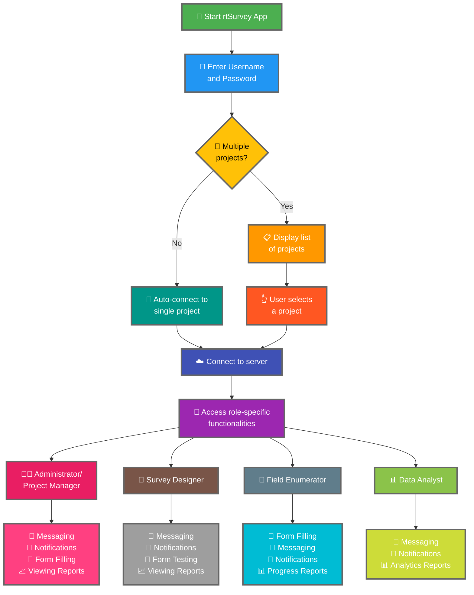

Połączenie aplikacji rtSurvey z serwerem to kluczowy krok do rozpoczęcia korzystania z aplikacji do zbierania danych, zarządzania i analizy. Proces ten zapewnia, że wszystkie role ankietowe mogą uzyskiwać dostęp do niezbędnych funkcji i danych w czasie rzeczywistym.

## Kluczowe różnice od ODK Collect

rtSurvey oferuje ulepszone funkcje w porównaniu z ODK Collect, obsługując różne role ankietowe:
- **Administrator**: Wiadomości, powiadomienia o aktualizacjach (przesyłanie danych, nowe raporty, nowe konta), wypełnianie formularzy i przeglądanie raportów analitycznych.
- **Kierownik projektu**: Podobne funkcje jak Administratorzy, w tym konfiguracja i zarządzanie projektami.
- **Projektant ankiety**: Wiadomości, powiadomienia, wypełnianie formularzy i przeglądanie raportów analitycznych.
- **Ankieter terenowy**: Wypełnianie formularzy, wiadomości, powiadomienia i raporty postępu.
- **Analityk danych**: Wiadomości, powiadomienia i dostęp do raportów analitycznych.

## Kroki łączenia aplikacji rtSurvey z serwerem

### 1. Upewnij się, że masz konto

Aby połączyć się z serwerem, potrzebujesz konta. Konta mogą być tworzone przez Administratora lub przez personel korzystający z URL tworzenia konta skonfigurowanego przez Administratora.

### 2. Otwórz aplikację rtSurvey

Uruchom aplikację rtSurvey na urządzeniu mobilnym. Jeśli jeszcze jej nie zainstalowałeś, zapoznaj się ze stroną [Instalacja rtSurvey](#installing-rtsurvey-app).

### 3. Dostęp do ustawień połączenia z serwerem

1. Otwórz aplikację i przejdź do menu ustawień.
2. Wybierz opcję połączenia z serwerem.

### 4. Wprowadź dane konta i wybierz projekt

Podczas łączenia z rtSurvey proces jest uproszczony na podstawie konfiguracji konta:

- **Nazwa użytkownika**: Wprowadź nazwę użytkownika konta.
- **Hasło**: Wprowadź hasło konta.

Po wprowadzeniu danych uwierzytelniających:

- Jeśli Twoje konto jest powiązane tylko z jednym projektem ankietowym:
  - Aplikacja automatycznie zaloguje Cię na serwer tego projektu.
  - Nie musisz ręcznie wprowadzać adresu URL serwera ani wybierać projektu.

- Jeśli Twoje konto jest powiązane z wieloma projektami ankietowymi:
  - Po pomyślnym uwierzytelnieniu zobaczysz listę projektów, do których masz dostęp.
  - Wybierz projekt, nad którym chcesz pracować z tej listy.

### 5. Uwierzytelnij się

Po wprowadzeniu danych serwera dotknij przycisku „Połącz" lub „Zaloguj się". Aplikacja uwierzytelni Twoje dane i nawiąże połączenie z serwerem.

## Rozwiązywanie problemów z połączeniem

Jeśli napotkasz problemy podczas łączenia z serwerem:

1. **Sprawdź połączenie internetowe**: Upewnij się, że urządzenie jest podłączone do Internetu.
2. **Potwierdź dane uwierzytelniające**: Upewnij się, że nazwa użytkownika i hasło są prawidłowe.
3. **Uruchom ponownie aplikację**: Zamknij i otwórz ponownie aplikację rtSurvey.
4. **Skontaktuj się z pomocą techniczną**: Jeśli problemy utrzymują się, skontaktuj się z administratorem systemu lub pomocą techniczną rtSurvey.

## Podsumowanie

Połączenie aplikacji rtSurvey z serwerem to prosty proces umożliwiający pełne wykorzystanie możliwości aplikacji. Postępując zgodnie z powyższymi krokami, możesz zapewnić bezproblemowe zbieranie danych, zarządzanie i analizę dostosowane do Twojej konkretnej roli ankietowej.
