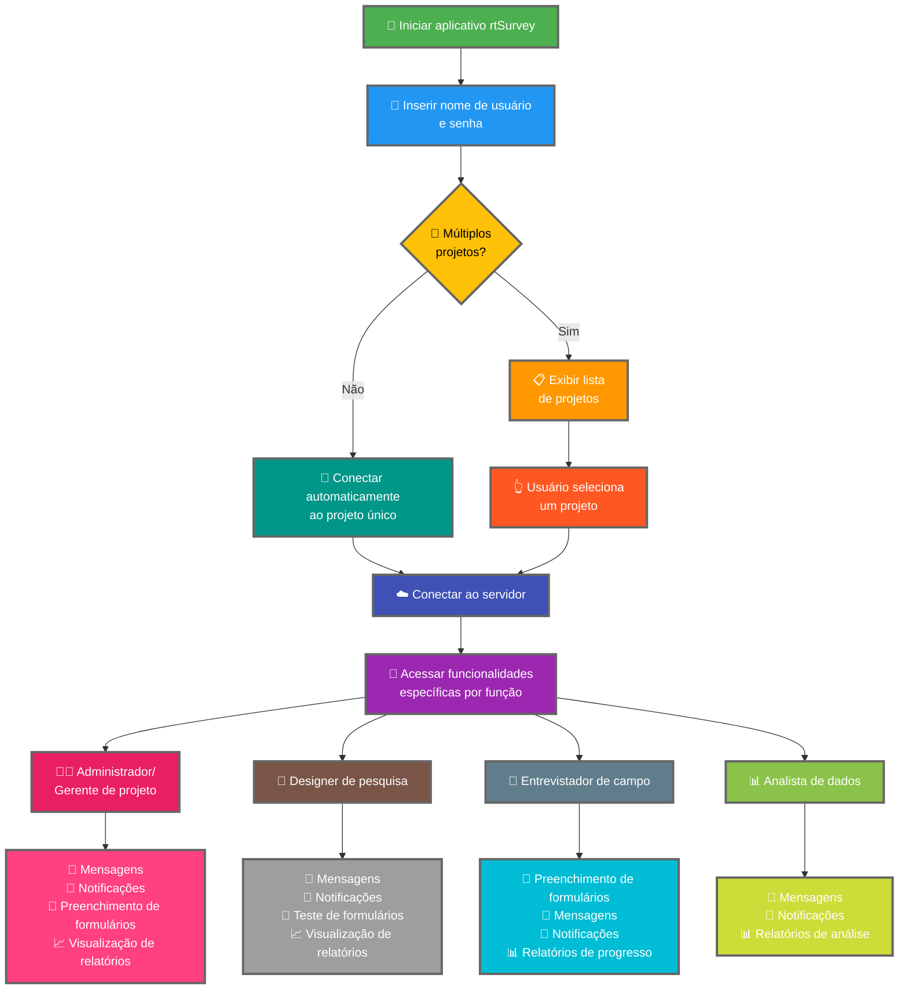

Conectar o aplicativo rtSurvey a um servidor é uma etapa crucial para começar a usar o aplicativo para coleta, gerenciamento e análise de dados. Este processo garante que todas as funções de pesquisa possam acessar as funcionalidades e dados necessários em tempo real.

## Principais diferenças em relação ao ODK Collect

O rtSurvey oferece funcionalidades aprimoradas em comparação com o ODK Collect, atendendo a vários papéis de pesquisa:
- **Administrador**: Mensagens, notificações de atualizações (envio de dados, novos relatórios, novas contas), preenchimento de formulários e visualização de relatórios de análise.
- **Gerente de projeto**: Funcionalidades semelhantes às dos administradores, incluindo configuração e gerenciamento de projetos.
- **Designer de pesquisa**: Mensagens, notificações, preenchimento de formulários e visualização de relatórios de análise.
- **Entrevistador de campo**: Preenchimento de formulários, mensagens, notificações e relatórios de progresso.
- **Analista de dados**: Mensagens, notificações e acesso a relatórios de análise.

## Etapas para conectar o aplicativo rtSurvey a um servidor

### 1. Certifique-se de ter uma conta

Para se conectar ao servidor, você precisa de uma conta. As contas podem ser criadas por um administrador ou pelos membros da equipe usando uma URL de criação de conta configurada pelo administrador.

### 2. Abra o aplicativo rtSurvey

Inicie o aplicativo rtSurvey no seu dispositivo móvel. Se você ainda não o instalou, consulte a página [Instalando o aplicativo rtSurvey](#installing-rtsurvey-app).

### 3. Acesse as configurações de conexão do servidor

1. Abra o aplicativo e navegue até o menu de configurações.
2. Selecione a opção de conectar a um servidor.

### 4. Insira os detalhes da conta e selecione o projeto

Ao se conectar ao rtSurvey, o processo é simplificado com base na configuração da sua conta:

- **Nome de usuário**: Insira o nome de usuário da sua conta.
- **Senha**: Insira a senha da sua conta.

Após inserir suas credenciais:

- Se sua conta estiver associada a apenas um projeto de pesquisa:
  - O aplicativo irá conectá-lo automaticamente ao servidor desse projeto.
  - Você não precisa inserir uma URL do servidor ou selecionar um projeto manualmente.

- Se sua conta estiver associada a vários projetos de pesquisa:
  - Após a autenticação bem-sucedida, você verá uma lista dos projetos aos quais tem acesso.
  - Selecione o projeto no qual deseja trabalhar nessa lista.

### 5. Autentique-se

Após inserir os detalhes do servidor, toque no botão "Conectar" ou "Entrar". O aplicativo autenticará suas credenciais e estabelecerá uma conexão com o servidor.

## Solução de problemas de conexão

Se você encontrar problemas ao conectar ao servidor:

1. **Verifique a conexão com a internet**: Certifique-se de que seu dispositivo está conectado à internet.
2. **Confirme as credenciais**: Certifique-se de que seu nome de usuário e senha estão corretos.
3. **Reinicie o aplicativo**: Feche e reabra o aplicativo rtSurvey.
4. **Entre em contato com o suporte**: Se os problemas persistirem, entre em contato com o administrador do sistema ou com o suporte do rtSurvey para obter assistência.

## Conclusão

Conectar o aplicativo rtSurvey a um servidor é um processo simples que permite aproveitar todas as capacidades do aplicativo. Seguindo as etapas descritas acima, você pode garantir coleta, gerenciamento e análise de dados perfeitos, adaptados ao seu papel específico de pesquisa.
