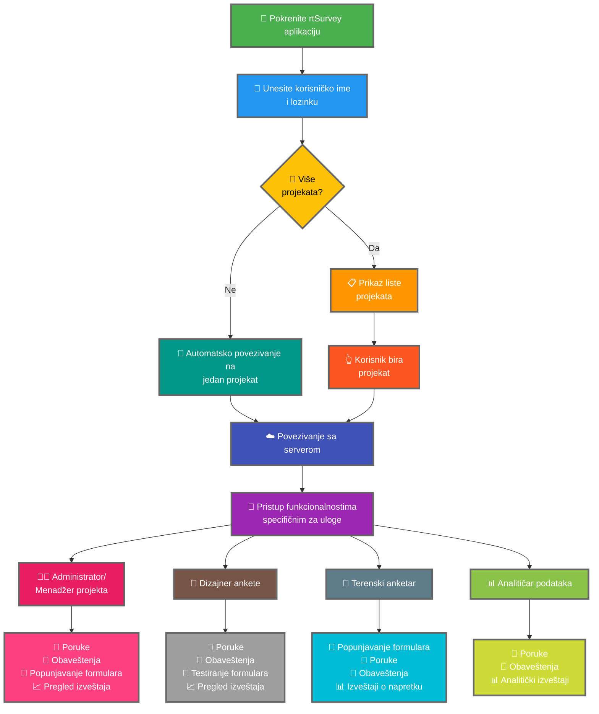

Povezivanje rtSurvey aplikacije sa serverom je ključni korak za početak korišćenja aplikacije za prikupljanje, upravljanje i analizu podataka. Ovaj proces osigurava da sve uloge ankete mogu pristupiti potrebnim funkcionalnostima i podacima u realnom vremenu.

## Ključne razlike od ODK Collect-a

rtSurvey nudi poboljšane funkcionalnosti u poređenju sa ODK Collect-om, prilagođene različitim ulogama ankete:
- **Administrator**: Razmena poruka, obaveštenja o ažuriranjima (slanje podataka, novi izveštaji, novi nalozi), popunjavanje formulara i pregled analitičkih izveštaja.
- **Menadžer projekta**: Slične funkcionalnosti kao administratori, uključujući podešavanje i upravljanje projektima.
- **Dizajner ankete**: Razmena poruka, obaveštenja, popunjavanje formulara i pregled analitičkih izveštaja.
- **Terenski anketar**: Popunjavanje formulara, razmena poruka, obaveštenja i izveštaji o napretku.
- **Analitičar podataka**: Razmena poruka, obaveštenja i pristup analitičkim izveštajima.

## Koraci za povezivanje rtSurvey aplikacije sa serverom

### 1. Proverite da li imate nalog

Da biste se povezali sa serverom, potreban vam je nalog. Naloge može kreirati administrator ili osoblje koristeći URL za kreiranje naloga koji je postavio administrator.

### 2. Otvorite rtSurvey aplikaciju

Pokrenite rtSurvey aplikaciju na mobilnom uređaju. Ako je još niste instalirali, pogledajte stranicu [Instalacija rtSurvey aplikacije](#installing-rtsurvey-app).

### 3. Pristupite podešavanjima veze sa serverom

1. Otvorite aplikaciju i navigirajte do menija podešavanja.
2. Izaberite opciju za povezivanje sa serverom.

### 4. Unesite detalje naloga i izaberite projekat

Kada se povezujete sa rtSurvey-om, proces je pojednostavljen na osnovu konfiguracije vašeg naloga:

- **Korisničko ime**: Unesite korisničko ime naloga.
- **Lozinka**: Unesite lozinku naloga.

Nakon unosa akreditiva:

- Ako je vaš nalog vezan za samo jedan anketni projekat:
  - Aplikacija će vas automatski prijaviti na server tog projekta.
  - Nije potrebno da unesete URL servera ili ručno izaberete projekat.

- Ako je vaš nalog vezan za više anketnih projekata:
  - Nakon uspešne autentifikacije, videćete listu projekata kojima imate pristup.
  - Izaberite projekat na kome želite da radite sa ove liste.

### 5. Autentifikujte se

Nakon unosa detalja servera, dodirnite dugme "Poveži" ili "Prijavi se". Aplikacija će autentifikovati vaše akreditive i uspostaviti vezu sa serverom.

## Rešavanje problema sa vezom

Ako naiđete na probleme pri povezivanju sa serverom:

1. **Proverite internet vezu**: Proverite da li je vaš uređaj povezan na internet.
2. **Potvrdite akreditive**: Proverite da li su vaše korisničko ime i lozinka ispravni.
3. **Ponovo pokrenite aplikaciju**: Zatvorite i ponovo otvorite rtSurvey aplikaciju.
4. **Kontaktirajte podršku**: Ako problemi potraju, kontaktirajte administratora sistema ili rtSurvey podršku za pomoć.

## Zaključak

Povezivanje rtSurvey aplikacije sa serverom je jednostavan proces koji vam omogućava da koristite pune mogućnosti aplikacije. Prateći gore navedene korake, možete osigurati besprekorno prikupljanje podataka, upravljanje i analizu prilagođenu vašoj specifičnoj ulozi u anketi.
