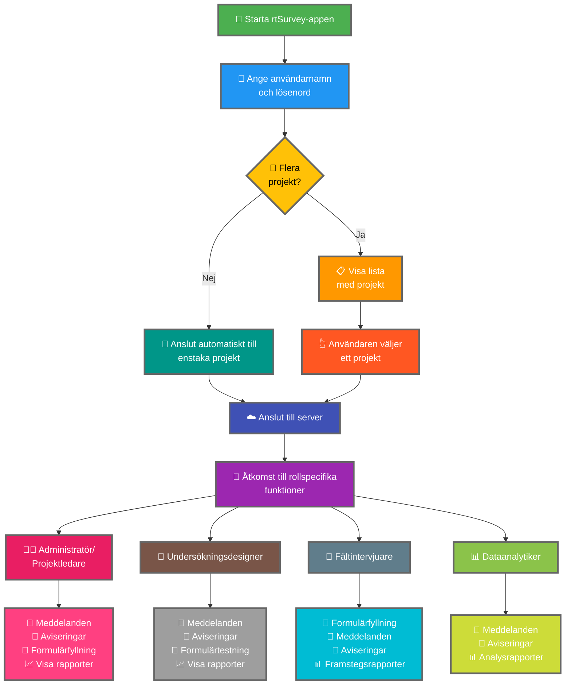

Att ansluta rtSurvey-appen till en server är ett avgörande steg för att börja använda appen för datainsamling, -hantering och -analys. Denna process säkerställer att alla undersökningsroller kan komma åt nödvändiga funktioner och data i realtid.

## Viktiga skillnader från ODK Collect

rtSurvey erbjuder utökade funktioner jämfört med ODK Collect, anpassade till olika undersökningsroller:
- **Administratör**: Meddelanden, aviseringar om uppdateringar (datainlämning, nya rapporter, nya konton), formulärfyllning och visning av analysrapporter.
- **Projektledare**: Liknande funktioner som administratörer, inklusive projektkonfiguration och -hantering.
- **Undersökningsdesigner**: Meddelanden, aviseringar, formulärfyllning och visning av analysrapporter.
- **Fältintervjuare**: Formulärfyllning, meddelanden, aviseringar och framstegsrapporter.
- **Dataanalytiker**: Meddelanden, aviseringar och tillgång till analysrapporter.

## Steg för att ansluta rtSurvey-appen till en server

### 1. Se till att du har ett konto

För att ansluta till servern behöver du ett konto. Konton kan skapas av en administratör eller av personal med hjälp av en kontoskapande URL inrättad av administratören.

### 2. Öppna rtSurvey-appen

Starta rtSurvey-appen på din mobila enhet. Om du inte har installerat den ännu, se sidan [Installera rtSurvey-appen](#installing-rtsurvey-app).

### 3. Öppna serveranslutningsinställningarna

1. Öppna appen och navigera till inställningsmenyn.
2. Välj alternativet för att ansluta till en server.

### 4. Ange kontouppgifter och välj projekt

När du ansluter till rtSurvey är processen strömlinjeformad baserat på din kontokonfiguration:

- **Användarnamn**: Ange ditt kontoanvändarnamn.
- **Lösenord**: Ange ditt kontolösenord.

Efter att du angett dina uppgifter:

- Om ditt konto är associerat med endast ett undersökningsprojekt:
  - Appen loggar in dig automatiskt på det projektets server.
  - Du behöver inte ange en server-URL eller välja ett projekt manuellt.

- Om ditt konto är associerat med flera undersökningsprojekt:
  - Efter lyckad autentisering ser du en lista över projekt du har åtkomst till.
  - Välj det projekt du vill arbeta med från den här listan.

### 5. Autentisera

Efter att du angett serveruppgifterna, tryck på knappen "Anslut" eller "Logga in". Appen autentiserar dina uppgifter och upprättar en anslutning till servern.

## Felsökning av anslutningsproblem

Om du stöter på problem när du ansluter till servern:

1. **Kontrollera internetanslutningen**: Se till att din enhet är ansluten till internet.
2. **Bekräfta uppgifter**: Se till att ditt användarnamn och lösenord är korrekta.
3. **Starta om appen**: Stäng och öppna rtSurvey-appen igen.
4. **Kontakta support**: Om problemen kvarstår, kontakta din systemadministratör eller rtSurvey-support för hjälp.

## Slutsats

Att ansluta rtSurvey-appen till en server är en enkel process som gör att du kan utnyttja appens fulla kapacitet. Genom att följa stegen ovan kan du säkerställa sömlös datainsamling, -hantering och -analys anpassad till din specifika undersökningsroll.
