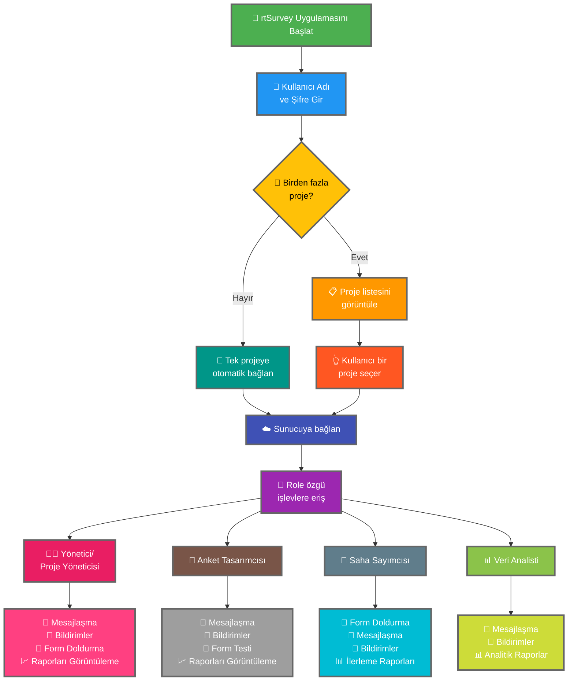

rtSurvey uygulamasını bir sunucuya bağlamak, uygulamayı veri toplama, yönetim ve analiz için kullanmaya başlamanın kritik bir adımıdır. Bu süreç, tüm anket rollerinin gerekli işlevlere ve verilere gerçek zamanlı olarak erişebilmesini sağlar.

## ODK Collect ile Temel Farklar

rtSurvey, çeşitli anket rollerine hitap ederek ODK Collect'e kıyasla gelişmiş işlevler sunar:
- **Yönetici**: Mesajlaşma, güncelleme bildirimleri (veri gönderimi, yeni raporlar, yeni hesaplar), form doldurma ve analiz raporlarını görüntüleme.
- **Proje Yöneticisi**: Proje kurulum ve yönetimi dahil yöneticilere benzer işlevler.
- **Anket Tasarımcısı**: Mesajlaşma, bildirimler, form doldurma ve analiz raporlarını görüntüleme.
- **Saha Sayımcısı**: Form doldurma, mesajlaşma, bildirimler ve ilerleme raporları.
- **Veri Analisti**: Mesajlaşma, bildirimler ve analitik raporlara erişim.

## rtSurvey Uygulamasını Sunucuya Bağlama Adımları

### 1. Hesabınız Olduğundan Emin Olun

Sunucuya bağlanmak için bir hesaba ihtiyacınız var. Hesaplar bir Yönetici tarafından veya Yönetici tarafından oluşturulan bir hesap oluşturma URL'si aracılığıyla personel tarafından oluşturulabilir.

### 2. rtSurvey Uygulamasını Açın

Mobil cihazınızda rtSurvey uygulamasını başlatın. Henüz yüklemediyseniz, [rtSurvey Uygulamasını Yükleme](#installing-rtsurvey-app) sayfasına bakın.

### 3. Sunucu Bağlantı Ayarlarına Erişin

1. Uygulamayı açın ve ayarlar menüsüne gidin.
2. Bir sunucuya bağlanma seçeneğini belirleyin.

### 4. Hesap Ayrıntılarını Girin ve Proje Seçin

rtSurvey'e bağlanırken süreç, hesap yapılandırmanıza göre kolaylaştırılmıştır:

- **Kullanıcı Adı**: Hesap kullanıcı adınızı girin.
- **Şifre**: Hesap şifrenizi girin.

Kimlik bilgilerinizi girdikten sonra:

- Hesabınız yalnızca bir anket projesiyle ilişkilendirilmişse:
  - Uygulama sizi otomatik olarak o projenin sunucusuna bağlar.
  - Bir sunucu URL'si girmenize veya manuel olarak bir proje seçmenize gerek yoktur.

- Hesabınız birden fazla anket projesiyle ilişkilendirilmişse:
  - Başarılı kimlik doğrulamanın ardından, erişiminizin olduğu projelerin listesini göreceksiniz.
  - Bu listeden çalışmak istediğiniz projeyi seçin.

### 5. Kimlik Doğrulama

Sunucu ayrıntılarını girdikten sonra "Bağlan" veya "Giriş Yap" düğmesine dokunun. Uygulama kimlik bilgilerinizi doğrulayacak ve sunucuyla bağlantı kuracaktır.

## Bağlantı Sorunlarını Giderme

Sunucuya bağlanırken sorunlarla karşılaşırsanız:

1. **İnternet Bağlantısını Kontrol Edin**: Cihazınızın internete bağlı olduğundan emin olun.
2. **Kimlik Bilgilerini Doğrulayın**: Kullanıcı adı ve şifrenizin doğru olduğundan emin olun.
3. **Uygulamayı Yeniden Başlatın**: rtSurvey uygulamasını kapatın ve yeniden açın.
4. **Destek ile İletişime Geçin**: Sorunlar devam ederse, sistem yöneticinizle veya rtSurvey desteğiyle iletişime geçin.

## Sonuç

rtSurvey uygulamasını bir sunucuya bağlamak, uygulamanın tam kapasitesinden yararlanmanızı sağlayan basit bir süreçtir. Yukarıda özetlenen adımları izleyerek, belirli anket rolünüze göre uyarlanmış kesintisiz veri toplama, yönetim ve analizi sağlayabilirsiniz.
