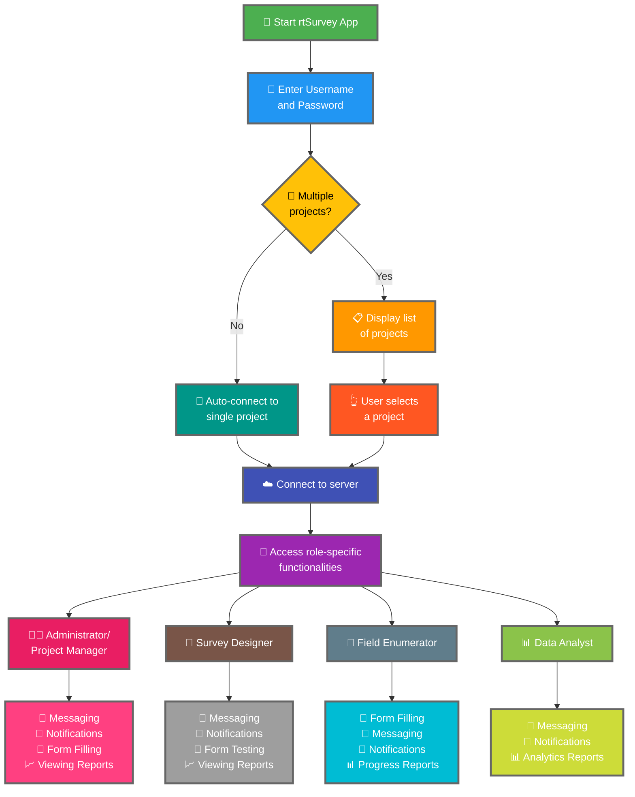

將 rtSurvey 應用程式連接至伺服器是開始使用應用程式進行資料收集、管理和分析的關鍵步驟。此流程確保所有問卷調查角色可以即時存取必要的功能和資料。

## 與 ODK Collect 的主要差異

rtSurvey 提供比 ODK Collect 更強大的功能，滿足各種問卷調查角色的需求：
- **管理員**：訊息傳遞、更新通知（資料提交、新報告、新帳號）、表單填寫和查看分析報告。
- **專案經理**：與管理員類似的功能，包括專案設置和管理。
- **問卷設計師**：訊息傳遞、通知、表單填寫和查看分析報告。
- **現場調查員**：表單填寫、訊息傳遞、通知和進度報告。
- **資料分析師**：訊息傳遞、通知和存取分析報告。

## 將 rtSurvey 應用程式連接至伺服器的步驟

### 1. 確保您有帳號

要連接至伺服器，您需要一個帳號。帳號可以由管理員建立，或由員工使用管理員設定的帳號建立 URL 建立。

### 2. 開啟 rtSurvey 應用程式

在您的行動裝置上啟動 rtSurvey 應用程式。如果您尚未安裝，請參閱[安裝 rtSurvey 應用程式](#installing-rtsurvey-app)頁面。

### 3. 存取伺服器連接設定

1. 開啟應用程式並導航至設定選單。
2. 選取連接至伺服器的選項。

### 4. 輸入帳號詳情並選取專案

連接至 rtSurvey 時，流程根據您的帳號設定而簡化：

- **使用者名稱**：輸入您的帳號使用者名稱。
- **密碼**：輸入您的帳號密碼。

輸入您的憑證後：

- 如果您的帳號只與一個問卷調查專案關聯：
  - 應用程式將自動登入該專案的伺服器。
  - 您無需輸入伺服器 URL 或手動選取專案。

- 如果您的帳號與多個問卷調查專案關聯：
  - 成功驗證後，您將看到您可存取的專案清單。
  - 從此清單中選取您想處理的專案。

### 5. 驗證

輸入伺服器詳情後，點選「連接」或「登入」按鈕。應用程式將驗證您的憑證並建立與伺服器的連接。

## 連接問題疑難排解

如果在連接伺服器時遇到問題：

1. **檢查網際網路連接**：確保您的裝置已連接至網際網路。
2. **確認憑證**：確保您的使用者名稱和密碼正確。
3. **重啟應用程式**：關閉並重新開啟 rtSurvey 應用程式。
4. **聯繫支援**：如果問題持續，請聯繫您的系統管理員或 rtSurvey 支援以取得協助。

## 結論

將 rtSurvey 應用程式連接至伺服器是一個簡單的流程，讓您能夠充分利用應用程式的功能。按照上述步驟，您可以確保根據您的特定問卷調查角色進行無縫的資料收集、管理和分析。
