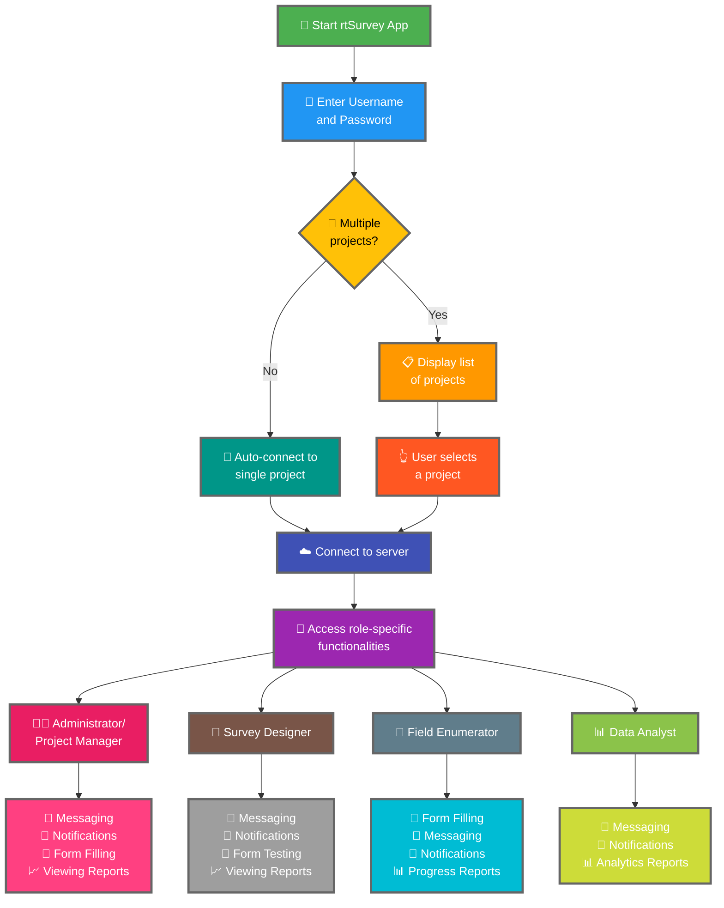

Свързването на приложението rtSurvey към сървър е важна стъпка за започване на използването на приложението за събиране, управление и анализ на данни. Този процес гарантира, че всички роли в анкетата могат да имат достъп до необходимите функционалности и данни в реално време.

## Основни разлики от ODK Collect

rtSurvey предлага разширени функционалности в сравнение с ODK Collect, обслужвайки различни роли в анкетата:
- **Администратор**: Съобщения, известия за актуализации (подаване на данни, нови отчети, нови акаунти), попълване на формуляри и преглед на аналитични отчети.
- **Ръководител на проект**: Подобни функционалности като тези на администраторите, включително настройка и управление на проекти.
- **Дизайнер на анкети**: Съобщения, известия, попълване на формуляри и преглед на аналитични отчети.
- **Теренен анкетьор**: Попълване на формуляри, съобщения, известия и отчети за напредък.
- **Анализатор на данни**: Съобщения, известия и достъп до аналитични отчети.

## Стъпки за свързване на приложението rtSurvey към сървър

### 1. Уверете се, че имате акаунт

За да се свържете към сървъра, имате нужда от акаунт. Акаунтите могат да бъдат създадени от администратор или от персонала чрез URL адрес за създаване на акаунт, настроен от администратора.

### 2. Отворете приложението rtSurvey

Стартирайте приложението rtSurvey на мобилното си устройство. Ако все още не сте го инсталирали, вижте страницата [Инсталиране на приложението rtSurvey](#installing-rtsurvey-app).

### 3. Достъп до настройките за свързване към сървър

1. Отворете приложението и навигирайте до менюто с настройки.
2. Изберете опцията за свързване към сървър.

### 4. Въведете данни за акаунт и изберете проект

При свързване към rtSurvey, процесът е рационализиран въз основа на конфигурацията на вашия акаунт:

- **Потребителско име**: Въведете потребителското наименование на акаунта ви.
- **Парола**: Въведете паролата на акаунта ви.

След въвеждане на идентификационните данни:

- Ако акаунтът ви е свързан с само един анкетен проект:
  - Приложението автоматично ще ви впише в сървъра на този проект.
  - Не е необходимо ръчно въвеждане на URL адрес на сървъра или избор на проект.

- Ако акаунтът ви е свързан с множество анкетни проекти:
  - След успешно удостоверяване, ще видите списък с проектите, до които имате достъп.
  - Изберете проекта, с който искате да работите, от този списък.

### 5. Удостоверяване

След въвеждане на данните за сървъра, докоснете бутона "Свързване" или "Вход". Приложението ще удостовери вашите идентификационни данни и ще установи връзка към сървъра.

## Отстраняване на неизправности при свързване

Ако срещнете проблеми при свързване към сървъра:

1. **Проверете интернет връзката**: Уверете се, че устройството ви е свързано с интернет.
2. **Потвърдете идентификационните данни**: Уверете се, че потребителското наименование и паролата са правилни.
3. **Рестартирайте приложението**: Затворете и отворете отново приложението rtSurvey.
4. **Свържете се с поддръжката**: Ако проблемите продължават, свържете се с системния администратор или поддръжката на rtSurvey за помощ.

## Заключение

Свързването на приложението rtSurvey към сървър е прост процес, позволяващ ви да използвате пълните възможности на приложението. Като следвате описаните по-горе стъпки, можете да осигурите безпроблемно събиране, управление и анализ на данни, съобразени с вашата конкретна роля в анкетата.
