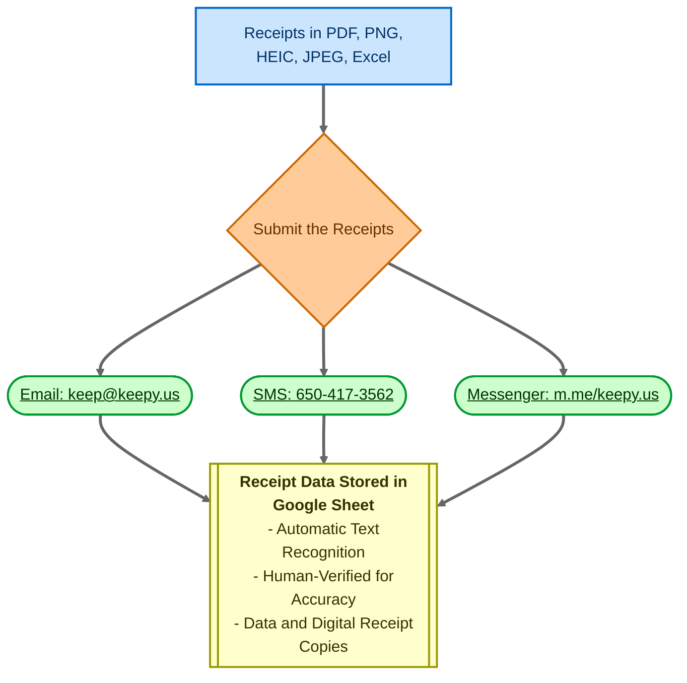

Die dynamische Suche (Dynamic Search) ist eine leistungsstarke Funktion in rtSurvey, mit der Sie dynamische Suchfunktionen in Ihre Umfragen integrieren können, um Daten in Echtzeit aus externen Quellen abzurufen.

## Syntax

Die grundlegende Syntax für die Verwendung der `search-api` lautet:

```
search-api(method, url, post_body, value_column, display, data_path, save_path)
```

### Parameter

- `method`: Verwenden Sie immer 'POST'
- `url`: Die URL zum Abrufen der Daten
- `post_body`: Der Anfragetext. Verwenden Sie die searchView-Syntax (siehe Dokumentation zu DataModel-Ansichten)
- `value_column`: Das Datenfeld, das als Wert verwendet werden soll
- `display`: Das Datenfeld, das als Label verwendet werden soll. Unterstützt eine Vorlagen-Syntax mit `##key##` und `@{func}` für erweiterte Formatierung
- `data_path`: JSONPath, um die gewünschten Daten aus der Antwort zu extrahieren (z. B. `$.hits.hits.*._source`)
- `save_path`: Ort zum Speichern der Antwortdaten für die spätere Verwendung

## Anwendungsbeispiele

### Grundlegende Verwendung

```
appearance: search-api('POST', 'https://api.example.com/search', '{"query": "%__input__%"}', 'id', 'name', '$.results', 'search_results')
```

### Mit erweiterter Anzeigeformatierung

```
appearance: search-api('POST', 'https://api.example.com/search', '{"query": "%__input__%"}', 'id', '##name## (##age## Jahre alt)', '$.results', 'search_results')
```

### Mit Funktion in der Anzeige

```
appearance: search-api('POST', 'https://api.example.com/search', '{"query": "%__input__%"}', 'id', '@{if_else(eq("##status##", "active"), "Aktiv: ##name##", "Inaktiv: ##name##")}', '$.results', 'search_results')
```

## Unterstützte Fragetypen

- `select_one`
- `select_multiple`
- `text` (für Autocomplete-Funktionalität)

## Zusätzliche Funktionen

### Standard-API (Default API)

Verwenden Sie `search-default-api()` nach `search-api()`, um Standardwerte festzulegen:

```
appearance: search-api(...) search-default-api(...)
```

### Trennzeichen für Mehrfachauswahl

Verwenden Sie für `select_multiple` `search-default-separator()`, um ein benutzerdefiniertes Trennzeichen anzugeben:

```
appearance: search-api(...) search-default-separator(' || ')
```

## Best Practices

1. Optimieren Sie API-Endpunkte für die Leistung, insbesondere bei großen Datensätzen.
2. Verwenden Sie geeignete Caching-Strategien, um API-Aufrufe zu reduzieren.
3. Gehen Sie in Ihrem Umfragedesign elegant mit Netzwerkfehlern um.
4. Testen Sie gründlich mit verschiedenen Eingabeszenarien.

## Bekannte Einschränkungen

- Komplexe Abfragen können die Ladezeiten der Umfrage beeinflussen.
- Die Offline-Funktionalität kann je nach Implementierung eingeschränkt sein.


