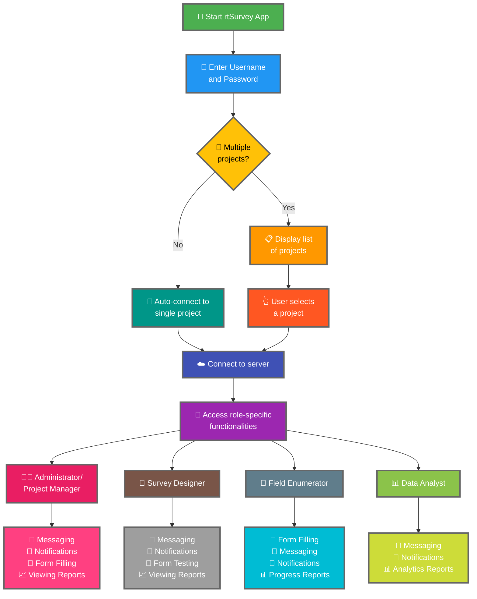

Connecting the rtSurvey app to a server is a crucial step to start using the app for data collection, management, and analysis. This process ensures that all survey roles can access the necessary functionalities and data in real-time.

## Key Differences from ODK Collect

rtSurvey offers enhanced functionalities compared to ODK Collect, catering to various survey roles:
- **Administrator**: Messaging, notifications for updates (data submission, new reports, new accounts), form filling, and viewing analysis reports.
- **Project Manager**: Similar functionalities as Administrators, including project setup and management.
- **Survey Designer**: Messaging, notifications, form filling, and viewing analysis reports.
- **Field Enumerator**: Form filling, messaging, notifications, and progress reports.
- **Data Analyst**: Messaging, notifications, and access to analytics reports.

## Steps to Connect rtSurvey App to a Server

### 1. Ensure You Have an Account

To connect to the server, you need an account. Accounts can be created by an Administrator or by staff using an account creation URL set up by the Administrator.

### 2. Open rtSurvey App

Launch the rtSurvey app on your mobile device. If you haven't installed it yet, refer to the [Installing rtSurvey App](#installing-rtsurvey-app) page.

### 3. Access the Server Connection Settings

1. Open the app and navigate to the settings menu.
2. Select the option to connect to a server.

### 4. Enter Account Details and Select Project

When connecting to rtSurvey, the process is streamlined based on your account configuration:

- **Username**: Enter your account username.
- **Password**: Enter your account password.

After entering your credentials:

- If your account is associated with only one survey project:
  - The app will automatically sign you into that project's server.
  - You don't need to enter a server URL or select a project manually.

- If your account is associated with multiple survey projects:
  - After successful authentication, you'll see a list of projects you have access to.
  - Select the project you want to work on from this list.

### 5. Authenticate

After entering the server details, tap on the "Connect" or "Login" button. The app will authenticate your credentials and establish a connection to the server.

## Troubleshooting Connection Issues

If you encounter issues while connecting to the server:

1. **Check Internet Connection**: Ensure your device is connected to the internet.
2. **Confirm Credentials**: Ensure your username and password are correct.
3. **Restart the App**: Close and reopen the rtSurvey app.
4. **Contact Support**: If issues persist, contact your system administrator or rtSurvey support for assistance.

## Conclusion

Connecting the rtSurvey app to a server is a straightforward process that enables you to leverage the full capabilities of the app. By following the steps outlined above, you can ensure seamless data collection, management, and analysis tailored to your specific survey role.
