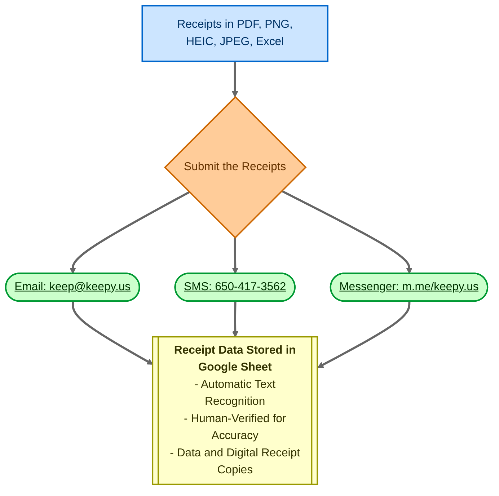

Dynamic Search is a powerful feature in rtSurvey that allows you to integrate dynamic search functionality into your surveys, enabling real-time data retrieval from external sources.

## Syntax

The basic syntax for using Search-API is:

```
search-api(method, url, post_body, value_column, display, data_path, save_path)
```

### Parameters

- `method`: Always use 'POST'
- `url`: The URL to fetch data from
- `post_body`: The request body. Use searchView syntax (see DataModel Views documentation)
- `value_column`: The data field to use as the value
- `display`: The data field to use as the label. Supports template-like syntax with `##key##` and `@{func}` for advanced formatting
- `data_path`: JSONPath to extract the desired data from the response (e.g., `$.hits.hits.*._source`)
- `save_path`: Location to store the response data for later use

## Usage Examples

### Basic Usage

```
appearance: search-api('POST', 'https://api.example.com/search', '{"query": "%__input__%"}', 'id', 'name', '$.results', 'search_results')
```

### With Advanced Display Formatting

```
appearance: search-api('POST', 'https://api.example.com/search', '{"query": "%__input__%"}', 'id', '##name## (##age## years old)', '$.results', 'search_results')
```

### With Function in Display

```
appearance: search-api('POST', 'https://api.example.com/search', '{"query": "%__input__%"}', 'id', '@{if_else(eq("##status##", "active"), "Active: ##name##", "Inactive: ##name##")}', '$.results', 'search_results')
```

## Supported Question Types

- `select_one`
- `select_multiple`
- `text` (for autocomplete functionality)

## Additional Features

### Default API

Use `search-default-api()` after `search-api()` to set default values:

```
appearance: search-api(...) search-default-api(...)
```

### Multiple Selection Separator

For `select_multiple`, use `search-default-separator()` to specify a custom separator:

```
appearance: search-api(...) search-default-separator(' || ')
```

## Best Practices

1. Optimize API endpoints for performance, especially with large datasets.
2. Use appropriate caching strategies to reduce API calls.
3. Handle network errors gracefully in your survey design.
4. Test thoroughly with various input scenarios.

## Known Limitations

- Complex queries may impact survey loading times.
- Offline functionality may be limited depending on the implementation.

