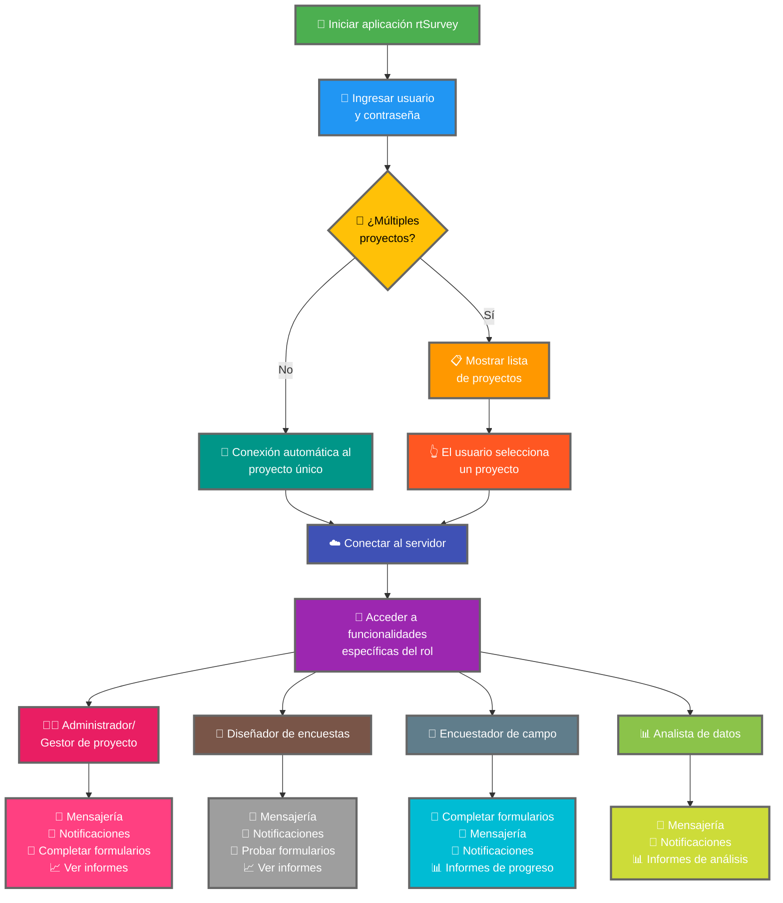

Conectar la aplicación rtSurvey a un servidor es un paso crucial para comenzar a usar la aplicación para recopilación, gestión y análisis de datos. Este proceso garantiza que todos los roles de encuesta puedan acceder a las funcionalidades y datos necesarios en tiempo real.

## Diferencias clave con ODK Collect

rtSurvey ofrece funcionalidades mejoradas en comparación con ODK Collect, adaptadas a diversos roles de encuesta:
- **Administrador**: Mensajería, notificaciones de actualizaciones (envío de datos, nuevos informes, nuevas cuentas), completar formularios y ver informes de análisis.
- **Gestor de proyecto**: Funcionalidades similares a las de los administradores, incluyendo configuración y gestión de proyectos.
- **Diseñador de encuestas**: Mensajería, notificaciones, completar formularios y ver informes de análisis.
- **Encuestador de campo**: Completar formularios, mensajería, notificaciones e informes de progreso.
- **Analista de datos**: Mensajería, notificaciones y acceso a informes de análisis.

## Pasos para conectar la aplicación rtSurvey a un servidor

### 1. Asegúrese de tener una cuenta

Para conectarse al servidor, necesita una cuenta. Las cuentas pueden ser creadas por un administrador o por el personal usando una URL de creación de cuenta configurada por el administrador.

### 2. Abra la aplicación rtSurvey

Inicie la aplicación rtSurvey en su dispositivo móvil. Si aún no la ha instalado, consulte la página [Instalación de la aplicación rtSurvey](#installing-rtsurvey-app).

### 3. Acceda a la configuración de conexión al servidor

1. Abra la aplicación y navegue al menú de configuración.
2. Seleccione la opción para conectarse a un servidor.

### 4. Ingrese los detalles de la cuenta y seleccione el proyecto

Al conectarse a rtSurvey, el proceso se simplifica según la configuración de su cuenta:

- **Usuario**: Ingrese el nombre de usuario de su cuenta.
- **Contraseña**: Ingrese la contraseña de su cuenta.

Después de ingresar sus credenciales:

- Si su cuenta está asociada con solo un proyecto de encuesta:
  - La aplicación lo conectará automáticamente al servidor de ese proyecto.
  - No necesita ingresar una URL de servidor ni seleccionar un proyecto manualmente.

- Si su cuenta está asociada con múltiples proyectos de encuesta:
  - Después de la autenticación exitosa, verá una lista de proyectos a los que tiene acceso.
  - Seleccione el proyecto en el que desea trabajar de esta lista.

### 5. Autentíquese

Después de ingresar los detalles del servidor, toque el botón "Conectar" o "Iniciar sesión". La aplicación autenticará sus credenciales y establecerá una conexión con el servidor.

## Solución de problemas de conexión

Si encuentra problemas al conectarse al servidor:

1. **Verifique la conexión a Internet**: Asegúrese de que su dispositivo esté conectado a Internet.
2. **Confirme las credenciales**: Asegúrese de que su nombre de usuario y contraseña sean correctos.
3. **Reinicie la aplicación**: Cierre y vuelva a abrir la aplicación rtSurvey.
4. **Contacte al soporte**: Si los problemas persisten, contacte a su administrador del sistema o al soporte de rtSurvey para obtener ayuda.

## Conclusión

Conectar la aplicación rtSurvey a un servidor es un proceso sencillo que le permite aprovechar al máximo las capacidades de la aplicación. Siguiendo los pasos descritos anteriormente, puede garantizar una recopilación, gestión y análisis de datos sin interrupciones, adaptados a su rol específico en la encuesta.
