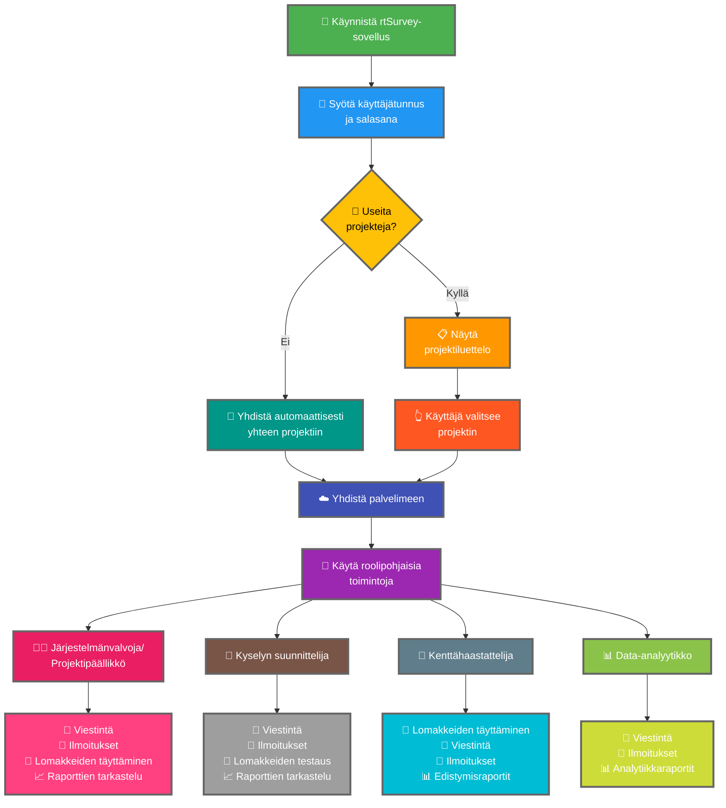

rtSurvey-sovelluksen yhdistäminen palvelimeen on välttämätön askel sovelluksen käytön aloittamiseksi tiedonkeruuseen, hallintaan ja analyysiin. Tämä prosessi varmistaa, että kaikki kyselyn roolit voivat käyttää tarvittavia toimintoja ja tietoja reaaliajassa.

## Tärkeimmät erot ODK Collectiin verrattuna

rtSurvey tarjoaa parannettuja toimintoja verrattuna ODK Collectiin eri kyselyn rooleja varten:
- **Järjestelmänvalvoja**: Viestintä, ilmoitukset päivityksistä (tietojen lähetys, uudet raportit, uudet tilit), lomakkeiden täyttäminen ja analyysiraporttien tarkastelu.
- **Projektipäällikkö**: Vastaavat toiminnot kuin järjestelmänvalvojilla, mukaan lukien projektin asetus ja hallinta.
- **Kyselyn suunnittelija**: Viestintä, ilmoitukset, lomakkeiden täyttäminen ja analyysiraporttien tarkastelu.
- **Kenttähaastattelija**: Lomakkeiden täyttäminen, viestintä, ilmoitukset ja edistymisraportit.
- **Data-analyytikko**: Viestintä, ilmoitukset ja pääsy analytiikkaraportteihin.

## Vaiheet rtSurvey-sovelluksen yhdistämiseksi palvelimeen

### 1. Varmista, että sinulla on tili

Yhdistääksesi palvelimeen tarvitset tilin. Tilit voi luoda järjestelmänvalvoja tai henkilöstö järjestelmänvalvojan asettaman tilinluonti-URL:n avulla.

### 2. Avaa rtSurvey-sovellus

Käynnistä rtSurvey-sovellus mobiililaitteellasi. Jos et ole vielä asentanut sitä, katso [rtSurvey-sovelluksen asentaminen](#installing-rtsurvey-app) -sivu.

### 3. Käytä palvelinyhteyden asetuksia

1. Avaa sovellus ja siirry asetusvalikkoon.
2. Valitse vaihtoehto yhdistääksesi palvelimeen.

### 4. Syötä tilitiedot ja valitse projekti

Yhdistäessäsi rtSurveyhin prosessi on virtaviivainen tilisi konfiguraation perusteella:

- **Käyttäjätunnus**: Syötä tilisi käyttäjätunnus.
- **Salasana**: Syötä tilisi salasana.

Tunnistetietojen syöttämisen jälkeen:

- Jos tilisi on liitetty vain yhteen kyselyprojektiin:
  - Sovellus kirjaa sinut automaattisesti kyseisen projektin palvelimeen.
  - Sinun ei tarvitse syöttää palvelimen URL-osoitetta tai valita projektia manuaalisesti.

- Jos tilisi on liitetty useisiin kyselyprojekteihin:
  - Onnistuneen todennuksen jälkeen näet luettelon projekteista, joihin sinulla on pääsy.
  - Valitse projekti, jolla haluat työskennellä, tästä luettelosta.

### 5. Todennus

Palvelintietojen syöttämisen jälkeen napauta "Yhdistä" tai "Kirjaudu sisään" -painiketta. Sovellus todentaa tunnistetietosi ja muodostaa yhteyden palvelimeen.

## Yhteysongelmien vianmääritys

Jos kohtaat ongelmia palvelimeen yhdistämisessä:

1. **Tarkista Internet-yhteys**: Varmista, että laitteesi on yhdistettynä Internetiin.
2. **Vahvista tunnistetiedot**: Varmista, että käyttäjätunnus ja salasana ovat oikein.
3. **Käynnistä sovellus uudelleen**: Sulje ja avaa rtSurvey-sovellus uudelleen.
4. **Ota yhteyttä tukeen**: Jos ongelmat jatkuvat, ota yhteyttä järjestelmänvalvojaasi tai rtSurveyn tukeen.

## Johtopäätös

rtSurvey-sovelluksen yhdistäminen palvelimeen on yksinkertainen prosessi, joka mahdollistaa sovelluksen täysien ominaisuuksien hyödyntämisen. Noudattamalla yllä esitettyjä vaiheita voit varmistaa saumattoman tiedonkeruun, -hallinnan ja -analyysin, joka on räätälöity kyselyroolillesi.
