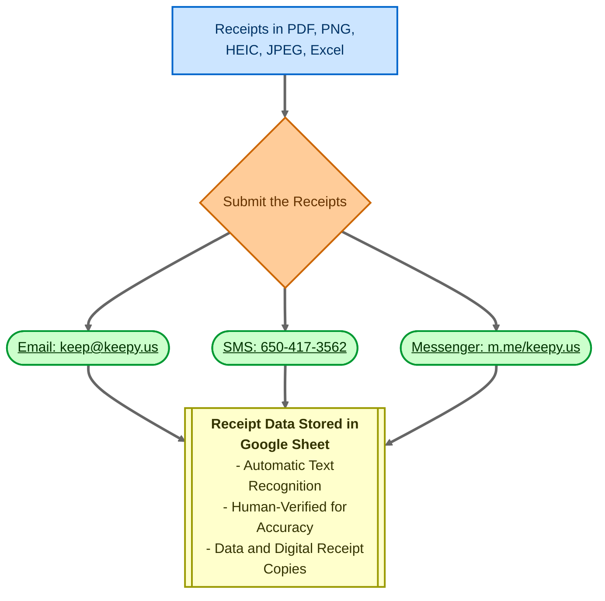

La recherche dynamique (Dynamic Search) est une fonctionnalité puissante de rtSurvey qui vous permet d'intégrer une fonctionnalité de recherche dynamique dans vos enquêtes, permettant la récupération de données en temps réel à partir de sources externes.

## Syntaxe

La syntaxe de base pour l'utilisation de `search-api` est :

```
search-api(method, url, post_body, value_column, display, data_path, save_path)
```

### Paramètres

- `method` : Utilisez toujours 'POST'
- `url` : L'URL pour récupérer les données
- `post_body` : Le corps de la requête. Utilisez la syntaxe searchView (voir la documentation sur les vues DataModel)
- `value_column` : Le champ de données à utiliser comme valeur
- `display` : Le champ de données à utiliser comme étiquette (label). Prend en charge une syntaxe de type modèle avec `##key##` et `@{func}` pour un formatage avancé
- `data_path` : JSONPath pour extraire les données souhaitées de la réponse (ex : `$.hits.hits.*._source`)
- `save_path` : Emplacement pour stocker les données de réponse pour une utilisation ultérieure

## Exemples d'utilisation

### Utilisation de base

```
appearance: search-api('POST', 'https://api.example.com/search', '{"query": "%__input__%"}', 'id', 'name', '$.results', 'search_results')
```

### Avec formatage d'affichage avancé

```
appearance: search-api('POST', 'https://api.example.com/search', '{"query": "%__input__%"}', 'id', '##name## (##age## ans)', '$.results', 'search_results')
```

### Avec fonction dans l'affichage

```
appearance: search-api('POST', 'https://api.example.com/search', '{"query": "%__input__%"}', 'id', '@{if_else(eq("##status##", "active"), "Actif : ##name##", "Inactif : ##name##")}', '$.results', 'search_results')
```

## Types de questions pris en charge

- `select_one`
- `select_multiple`
- `text` (pour la fonctionnalité d'autocomplétion)

## Caractéristiques supplémentaires

### API par défaut (Default API)

Utilisez `search-default-api()` après `search-api()` pour définir des valeurs par défaut :

```
appearance: search-api(...) search-default-api(...)
```

### Séparateur de sélection multiple

Pour `select_multiple`, utilisez `search-default-separator()` pour spécifier un séparateur personnalisé :

```
appearance: search-api(...) search-default-separator(' || ')
```

## Meilleures pratiques

1. Optimisez les points de terminaison de l'API pour la performance, en particulier avec de grands ensembles de données.
2. Utilisez des stratégies de mise en cache appropriées pour réduire les appels API.
3. Gérez les erreurs réseau avec élégance dans la conception de votre enquête.
4. Testez soigneusement avec divers scénarios de saisie.

## Limitations connues

- Les requêtes complexes peuvent impacter les temps de chargement de l'enquête.
- La fonctionnalité hors connexion peut être limitée selon l'implémentation.


