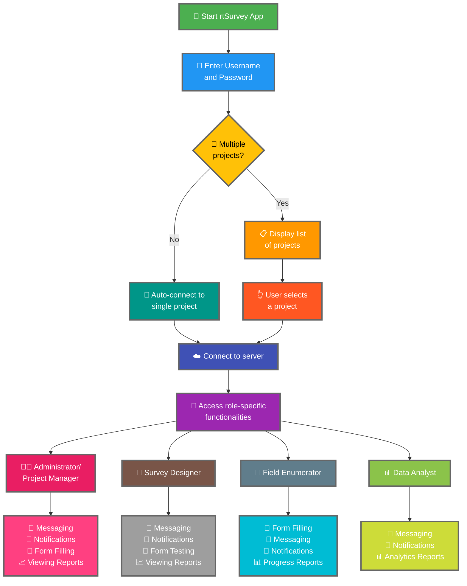

rtSurvey ऐप को एक सर्वर से कनेक्ट करना डेटा संग्रह, प्रबंधन और विश्लेषण के लिए ऐप का उपयोग शुरू करने का एक महत्वपूर्ण चरण है। यह प्रक्रिया सुनिश्चित करती है कि सभी सर्वेक्षण भूमिकाएं रियल-टाइम में आवश्यक कार्यात्मकताओं और डेटा तक पहुँच सकें।

## ODK Collect से मुख्य अंतर

rtSurvey विभिन्न सर्वेक्षण भूमिकाओं के लिए ODK Collect की तुलना में बेहतर कार्यात्मकताएं प्रदान करता है:
- **Administrator**: मैसेजिंग, अपडेट के लिए सूचनाएं (डेटा सबमिशन, नई रिपोर्ट, नए खाते), फ़ॉर्म भरना और विश्लेषण रिपोर्ट देखना।
- **Project Manager**: Administrators जैसी कार्यात्मकताएं, परियोजना सेटअप और प्रबंधन सहित।
- **Survey Designer**: मैसेजिंग, सूचनाएं, फ़ॉर्म भरना और विश्लेषण रिपोर्ट देखना।
- **Field Enumerator**: फ़ॉर्म भरना, मैसेजिंग, सूचनाएं और प्रगति रिपोर्ट।
- **Data Analyst**: मैसेजिंग, सूचनाएं और analytics रिपोर्ट तक पहुँच।

## rtSurvey ऐप को सर्वर से कनेक्ट करने के चरण

### 1. सुनिश्चित करें कि आपके पास एक खाता है

सर्वर से कनेक्ट करने के लिए, आपको एक खाते की आवश्यकता है। खाते Administrator द्वारा या Administrator द्वारा सेटअप किए गए खाता निर्माण URL का उपयोग करके स्टाफ द्वारा बनाए जा सकते हैं।

### 2. rtSurvey ऐप खोलें

अपने मोबाइल डिवाइस पर rtSurvey ऐप लॉन्च करें। यदि आपने इसे अभी तक इंस्टॉल नहीं किया है, तो [rtSurvey ऐप इंस्टॉल करना](#installing-rtsurvey-app) पेज देखें।

### 3. सर्वर कनेक्शन सेटिंग एक्सेस करें

1. ऐप खोलें और सेटिंग मेनू पर नेविगेट करें।
2. सर्वर से कनेक्ट करने का विकल्प चुनें।

### 4. खाता विवरण दर्ज करें और परियोजना चुनें

rtSurvey से कनेक्ट करते समय, प्रक्रिया आपके खाता कॉन्फ़िगरेशन के आधार पर सुव्यवस्थित होती है:

- **उपयोगकर्ता नाम**: अपना खाता उपयोगकर्ता नाम दर्ज करें।
- **पासवर्ड**: अपना खाता पासवर्ड दर्ज करें।

अपने क्रेडेंशियल दर्ज करने के बाद:

- यदि आपका खाता केवल एक सर्वेक्षण परियोजना से जुड़ा है:
  - ऐप स्वचालित रूप से उस परियोजना के सर्वर में आपको साइन इन करेगा।
  - आपको सर्वर URL दर्ज करने या मैन्युअल रूप से एक परियोजना चुनने की आवश्यकता नहीं है।

- यदि आपका खाता कई सर्वेक्षण परियोजनाओं से जुड़ा है:
  - सफल प्रमाणीकरण के बाद, आप उन परियोजनाओं की एक सूची देखेंगे जिन तक आपकी पहुँच है।
  - इस सूची से वह परियोजना चुनें जिस पर आप काम करना चाहते हैं।

### 5. प्रमाणित करें

सर्वर विवरण दर्ज करने के बाद, "Connect" या "Login" बटन पर टैप करें। ऐप आपके क्रेडेंशियल प्रमाणित करेगा और सर्वर से कनेक्शन स्थापित करेगा।

## कनेक्शन समस्याओं का समाधान

यदि सर्वर से कनेक्ट करते समय समस्याएं आती हैं:

1. **इंटरनेट कनेक्शन जांचें**: सुनिश्चित करें कि आपका डिवाइस इंटरनेट से कनेक्ट है।
2. **क्रेडेंशियल की पुष्टि करें**: सुनिश्चित करें कि आपका उपयोगकर्ता नाम और पासवर्ड सही है।
3. **ऐप पुनः शुरू करें**: rtSurvey ऐप बंद करें और फिर से खोलें।
4. **समर्थन से संपर्क करें**: यदि समस्याएं बनी रहती हैं, तो सहायता के लिए अपने सिस्टम administrator या rtSurvey समर्थन से संपर्क करें।

## निष्कर्ष

rtSurvey ऐप को एक सर्वर से कनेक्ट करना एक सीधी प्रक्रिया है जो आपको ऐप की पूर्ण क्षमताओं का लाभ उठाने में सक्षम बनाती है। ऊपर बताए गए चरणों का पालन करके, आप अपनी विशिष्ट सर्वेक्षण भूमिका के अनुकूल डेटा संग्रह, प्रबंधन और विश्लेषण सुनिश्चित कर सकते हैं।
