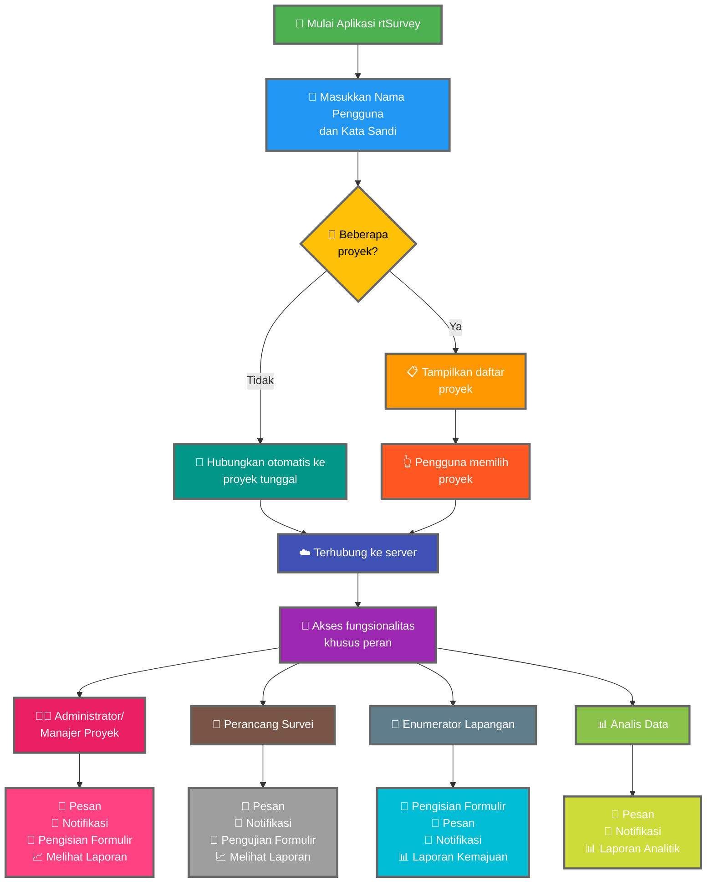

Menghubungkan aplikasi rtSurvey ke server adalah langkah penting untuk mulai menggunakan aplikasi ini untuk pengumpulan, manajemen, dan analisis data. Proses ini memastikan bahwa semua peran survei dapat mengakses fungsionalitas dan data yang diperlukan secara real-time.

## Perbedaan Utama dari ODK Collect

rtSurvey menawarkan fungsionalitas yang ditingkatkan dibandingkan dengan ODK Collect, melayani berbagai peran survei:
- **Administrator**: Pesan, notifikasi pembaruan (kiriman data, laporan baru, akun baru), pengisian formulir, dan melihat laporan analisis.
- **Manajer Proyek**: Fungsionalitas serupa dengan Administrator, termasuk pengaturan dan manajemen proyek.
- **Perancang Survei**: Pesan, notifikasi, pengisian formulir, dan melihat laporan analisis.
- **Enumerator Lapangan**: Pengisian formulir, pesan, notifikasi, dan laporan kemajuan.
- **Analis Data**: Pesan, notifikasi, dan akses ke laporan analitik.

## Langkah-langkah Menghubungkan Aplikasi rtSurvey ke Server

### 1. Pastikan Anda Memiliki Akun

Untuk terhubung ke server, Anda memerlukan akun. Akun dapat dibuat oleh Administrator atau oleh staf menggunakan URL pembuatan akun yang disiapkan oleh Administrator.

### 2. Buka Aplikasi rtSurvey

Luncurkan aplikasi rtSurvey di perangkat mobile Anda. Jika Anda belum memasangnya, lihat halaman [Memasang Aplikasi rtSurvey](#installing-rtsurvey-app).

### 3. Akses Pengaturan Koneksi Server

1. Buka aplikasi dan navigasi ke menu pengaturan.
2. Pilih opsi untuk terhubung ke server.

### 4. Masukkan Detail Akun dan Pilih Proyek

Saat terhubung ke rtSurvey, prosesnya disederhanakan berdasarkan konfigurasi akun Anda:

- **Nama pengguna**: Masukkan nama pengguna akun Anda.
- **Kata sandi**: Masukkan kata sandi akun Anda.

Setelah memasukkan kredensial Anda:

- Jika akun Anda dikaitkan hanya dengan satu proyek survei:
  - Aplikasi akan otomatis masuk ke server proyek tersebut.
  - Anda tidak perlu memasukkan URL server atau memilih proyek secara manual.

- Jika akun Anda dikaitkan dengan beberapa proyek survei:
  - Setelah autentikasi berhasil, Anda akan melihat daftar proyek yang dapat Anda akses.
  - Pilih proyek yang ingin Anda kerjakan dari daftar ini.

### 5. Autentikasi

Setelah memasukkan detail server, ketuk tombol "Hubungkan" atau "Masuk". Aplikasi akan mengautentikasi kredensial Anda dan menjalin koneksi ke server.

## Pemecahan Masalah Koneksi

Jika Anda mengalami masalah saat menghubungkan ke server:

1. **Periksa Koneksi Internet**: Pastikan perangkat Anda terhubung ke internet.
2. **Konfirmasi Kredensial**: Pastikan nama pengguna dan kata sandi Anda benar.
3. **Restart Aplikasi**: Tutup dan buka kembali aplikasi rtSurvey.
4. **Hubungi Dukungan**: Jika masalah berlanjut, hubungi administrator sistem atau dukungan rtSurvey untuk bantuan.

## Kesimpulan

Menghubungkan aplikasi rtSurvey ke server adalah proses yang mudah yang memungkinkan Anda memanfaatkan kemampuan penuh aplikasi ini. Dengan mengikuti langkah-langkah yang diuraikan di atas, Anda dapat memastikan pengumpulan, manajemen, dan analisis data yang mulus sesuai dengan peran survei spesifik Anda.
