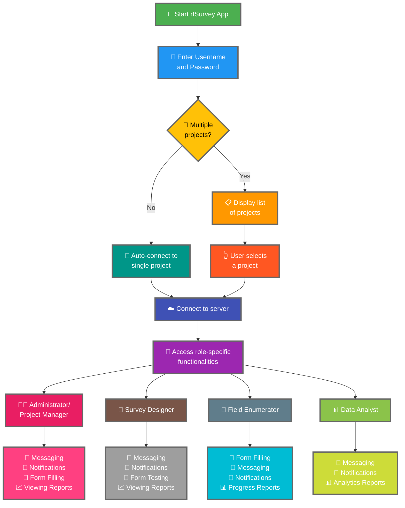

rtSurvey యాప్‌ను సర్వర్‌కు కనెక్ట్ చేయడం డేటా సేకరణ, నిర్వహణ మరియు విశ్లేషణ కోసం యాప్ ఉపయోగించడం ప్రారంభించడానికి కీలకమైన దశ. ఈ ప్రక్రియ అన్ని సర్వే పాత్రలు అవసరమైన కార్యాచరణలు మరియు డేటాను రియల్-టైమ్‌లో యాక్సెస్ చేయగలిగేలా నిర్ధారిస్తుంది.

## ODK Collect తో ముఖ్య తేడాలు

rtSurvey ODK Collect తో పోలిస్తే మెరుగైన కార్యాచరణలు అందిస్తుంది, వివిధ సర్వే పాత్రలకు సేవ చేస్తుంది:
- **Administrator**: మెసేజింగ్, అప్‌డేట్‌ల నోటిఫికేషన్‌లు (డేటా సమర్పణ, కొత్త నివేదికలు, కొత్త ఖాతాలు), ఫారం పూరించడం మరియు విశ్లేషణ నివేదికలు వీక్షించడం.
- **Project Manager**: ప్రాజెక్ట్ సెటప్ మరియు నిర్వహణ సహా అడ్మినిస్ట్రేటర్‌లకు సమానమైన కార్యాచరణలు.
- **Survey Designer**: మెసేజింగ్, నోటిఫికేషన్‌లు, ఫారం పూరించడం మరియు విశ్లేషణ నివేదికలు వీక్షించడం.
- **Field Enumerator**: ఫారం పూరించడం, మెసేజింగ్, నోటిఫికేషన్‌లు మరియు పురోగతి నివేదికలు.
- **Data Analyst**: మెసేజింగ్, నోటిఫికేషన్‌లు మరియు విశ్లేషణ నివేదికలకు యాక్సెస్.

## rtSurvey యాప్‌ను సర్వర్‌కు కనెక్ట్ చేసే దశలు

### 1. మీకు ఖాతా ఉందని నిర్ధారించుకోండి

సర్వర్‌కు కనెక్ట్ అవ్వడానికి, మీకు ఖాతా అవసరం. అడ్మినిస్ట్రేటర్ ద్వారా లేదా అడ్మినిస్ట్రేటర్ సెటప్ చేసిన ఖాతా సృష్టి URL ఉపయోగించి సిబ్బందికి ఖాతాలు సృష్టించబడతాయి.

### 2. rtSurvey యాప్ తెరవండి

మీ మొబైల్ పరికరంలో rtSurvey యాప్ ప్రారంభించండి. మీరు ఇంకా ఇన్‌స్టాల్ చేయకపోతే, [rtSurvey యాప్ ఇన్‌స్టాల్ చేయడం](#installing-rtsurvey-app) పేజీ చూడండి.

### 3. సర్వర్ కనెక్షన్ సెట్టింగులు యాక్సెస్ చేయండి

1. యాప్ తెరవండి మరియు సెట్టింగుల మెనూకు నావిగేట్ చేయండి.
2. సర్వర్‌కు కనెక్ట్ అవ్వే ఎంపిక ఎంచుకోండి.

### 4. ఖాతా వివరాలు ఎంటర్ చేసి ప్రాజెక్ట్ ఎంచుకోండి

rtSurvey కి కనెక్ట్ అవ్వేటప్పుడు, మీ ఖాతా కాన్ఫిగరేషన్ ఆధారంగా ప్రక్రియ సుగమంగా ఉంటుంది:

- **వినియోగదారు పేరు**: మీ ఖాతా వినియోగదారు పేరు ఎంటర్ చేయండి.
- **పాస్‌వర్డ్**: మీ ఖాతా పాస్‌వర్డ్ ఎంటర్ చేయండి.

మీ ఆధారపత్రాలు ఎంటర్ చేసిన తర్వాత:

- మీ ఖాతా ఒక్క సర్వే ప్రాజెక్ట్‌తో మాత్రమే అనుబంధించబడి ఉంటే:
  - యాప్ స్వయంచాలకంగా ఆ ప్రాజెక్ట్ సర్వర్‌కు సైన్ ఇన్ చేస్తుంది.
  - మీరు సర్వర్ URL ఎంటర్ చేయవలసిన అవసరం లేదా ప్రాజెక్ట్ మాన్యువల్‌గా ఎంచుకోవలసిన అవసరం లేదు.

- మీ ఖాతా బహుళ సర్వే ప్రాజెక్టులతో అనుబంధించబడి ఉంటే:
  - విజయవంతమైన ప్రమాణీకరణ తర్వాత, మీకు యాక్సెస్ ఉన్న ప్రాజెక్టుల జాబితా కనిపిస్తుంది.
  - జాబితా నుండి మీరు పని చేయాలనుకుంటున్న ప్రాజెక్ట్ ఎంచుకోండి.

### 5. ప్రమాణీకరించండి

సర్వర్ వివరాలు ఎంటర్ చేసిన తర్వాత, "Connect" లేదా "Login" బటన్‌పై నొక్కండి. యాప్ మీ ఆధారపత్రాలు ప్రమాణీకరిస్తుంది మరియు సర్వర్‌కు కనెక్షన్ ఏర్పాటు చేస్తుంది.

## కనెక్షన్ సమస్యలు పరిష్కరించడం

సర్వర్‌కు కనెక్ట్ అవ్వేటప్పుడు సమస్యలు ఎదుర్కొంటే:

1. **ఇంటర్నెట్ కనెక్షన్ తనిఖీ చేయండి**: మీ పరికరం ఇంటర్నెట్‌కు కనెక్ట్ అయిందని నిర్ధారించుకోండి.
2. **ఆధారపత్రాలు నిర్ధారించండి**: మీ వినియోగదారు పేరు మరియు పాస్‌వర్డ్ సరైనవని నిర్ధారించుకోండి.
3. **యాప్ పునఃప్రారంభించండి**: rtSurvey యాప్ మూసివేసి మళ్ళీ తెరవండి.
4. **సహాయం సంప్రదించండి**: సమస్యలు కొనసాగితే, మీ సిస్టమ్ అడ్మినిస్ట్రేటర్ లేదా rtSurvey మద్దతును సంప్రదించండి.

## ముగింపు

rtSurvey యాప్‌ను సర్వర్‌కు కనెక్ట్ చేయడం సరళమైన ప్రక్రియ, ఇది యాప్ యొక్క పూర్తి సామర్థ్యాలను ఉపయోగించుకోవడానికి అనుమతిస్తుంది. పైన వివరించిన దశలను అనుసరించడం ద్వారా, మీరు మీ నిర్దిష్ట సర్వే పాత్రకు అనుగుణంగా అనాయాస డేటా సేకరణ, నిర్వహణ మరియు విశ్లేషణ నిర్ధారించుకోవచ్చు.
