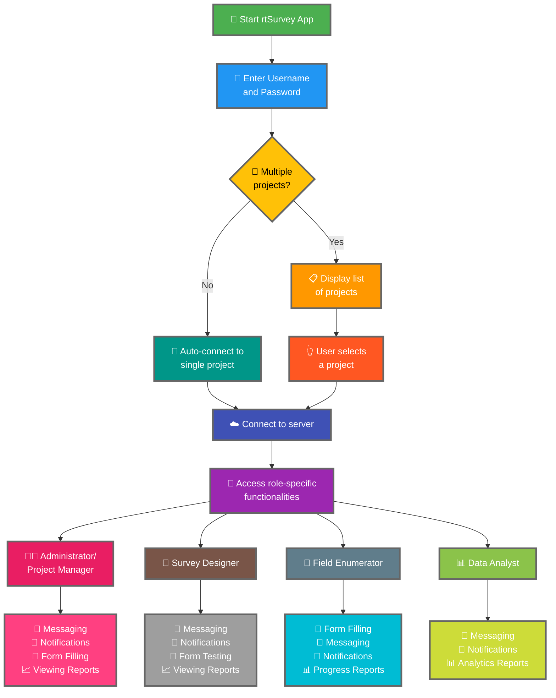

การเชื่อมต่อแอป rtSurvey กับเซิร์ฟเวอร์เป็นขั้นตอนสำคัญในการเริ่มใช้งานแอปสำหรับการเก็บข้อมูล การจัดการ และการวิเคราะห์ กระบวนการนี้ช่วยให้บทบาทการสำรวจทั้งหมดสามารถเข้าถึงฟังก์ชันและข้อมูลที่จำเป็นแบบเรียลไทม์

## ความแตกต่างหลักจาก ODK Collect

rtSurvey มีฟังก์ชันที่ปรับปรุงเพิ่มเติมเมื่อเทียบกับ ODK Collect รองรับบทบาทการสำรวจต่างๆ:
- **ผู้ดูแลระบบ**: ระบบส่งข้อความ การแจ้งเตือนสำหรับการอัปเดต (การส่งข้อมูล รายงานใหม่ บัญชีใหม่) การกรอกแบบฟอร์ม และการดูรายงานการวิเคราะห์
- **ผู้จัดการโปรเจกต์**: ฟังก์ชันคล้ายกับผู้ดูแลระบบ รวมถึงการตั้งค่าและการจัดการโปรเจกต์
- **นักออกแบบแบบสำรวจ**: ระบบส่งข้อความ การแจ้งเตือน การกรอกแบบฟอร์ม และการดูรายงานการวิเคราะห์
- **ผู้เก็บข้อมูลภาคสนาม**: การกรอกแบบฟอร์ม ระบบส่งข้อความ การแจ้งเตือน และรายงานความคืบหน้า
- **นักวิเคราะห์ข้อมูล**: ระบบส่งข้อความ การแจ้งเตือน และการเข้าถึงรายงานการวิเคราะห์

## ขั้นตอนการเชื่อมต่อแอป rtSurvey กับเซิร์ฟเวอร์

### 1. ตรวจสอบว่าคุณมีบัญชี

ในการเชื่อมต่อกับเซิร์ฟเวอร์ คุณต้องมีบัญชี บัญชีสามารถสร้างโดยผู้ดูแลระบบหรือเจ้าหน้าที่โดยใช้ URL การสร้างบัญชีที่ผู้ดูแลระบบตั้งค่าไว้

### 2. เปิดแอป rtSurvey

เปิดแอป rtSurvey บนอุปกรณ์มือถือของคุณ หากยังไม่ได้ติดตั้ง โปรดดูหน้า [การติดตั้งแอป rtSurvey](#installing-rtsurvey-app)

### 3. เข้าถึงการตั้งค่าการเชื่อมต่อเซิร์ฟเวอร์

1. เปิดแอปและไปที่เมนูการตั้งค่า
2. เลือกตัวเลือกการเชื่อมต่อกับเซิร์ฟเวอร์

### 4. ป้อนรายละเอียดบัญชีและเลือกโปรเจกต์

เมื่อเชื่อมต่อกับ rtSurvey กระบวนการจะถูกปรับให้เหมาะสมตามการกำหนดค่าบัญชีของคุณ:

- **ชื่อผู้ใช้**: ป้อนชื่อผู้ใช้บัญชีของคุณ
- **รหัสผ่าน**: ป้อนรหัสผ่านบัญชีของคุณ

หลังจากป้อนข้อมูลประจำตัว:

- หากบัญชีของคุณเชื่อมโยงกับโปรเจกต์สำรวจเพียงโปรเจกต์เดียว:
  - แอปจะลงชื่อเข้าใช้เซิร์ฟเวอร์โปรเจกต์นั้นโดยอัตโนมัติ
  - คุณไม่ต้องป้อน URL เซิร์ฟเวอร์หรือเลือกโปรเจกต์ด้วยตนเอง

- หากบัญชีของคุณเชื่อมโยงกับโปรเจกต์สำรวจหลายโปรเจกต์:
  - หลังจากการยืนยันตัวตนสำเร็จ คุณจะเห็นรายการโปรเจกต์ที่คุณมีสิทธิ์เข้าถึง
  - เลือกโปรเจกต์ที่ต้องการทำงานจากรายการนี้

### 5. ยืนยันตัวตน

หลังจากป้อนรายละเอียดเซิร์ฟเวอร์ แตะปุ่ม "เชื่อมต่อ" หรือ "เข้าสู่ระบบ" แอปจะตรวจสอบข้อมูลประจำตัวและสร้างการเชื่อมต่อกับเซิร์ฟเวอร์

## การแก้ไขปัญหาการเชื่อมต่อ

หากคุณพบปัญหาระหว่างการเชื่อมต่อกับเซิร์ฟเวอร์:

1. **ตรวจสอบการเชื่อมต่ออินเทอร์เน็ต**: ตรวจสอบให้แน่ใจว่าอุปกรณ์ของคุณเชื่อมต่ออินเทอร์เน็ต
2. **ยืนยันข้อมูลประจำตัว**: ตรวจสอบให้แน่ใจว่าชื่อผู้ใช้และรหัสผ่านถูกต้อง
3. **รีสตาร์ทแอป**: ปิดและเปิดแอป rtSurvey ใหม่
4. **ติดต่อฝ่ายสนับสนุน**: หากยังคงมีปัญหา ให้ติดต่อผู้ดูแลระบบหรือฝ่ายสนับสนุน rtSurvey เพื่อขอความช่วยเหลือ

## สรุป

การเชื่อมต่อแอป rtSurvey กับเซิร์ฟเวอร์เป็นกระบวนการที่ตรงไปตรงมาซึ่งช่วยให้คุณใช้ประโยชน์จากความสามารถทั้งหมดของแอป ด้วยการทำตามขั้นตอนที่ระบุไว้ข้างต้น คุณสามารถรับประกันการเก็บข้อมูล การจัดการ และการวิเคราะห์ที่ราบรื่น ตามบทบาทการสำรวจที่เฉพาะเจาะจงของคุณ