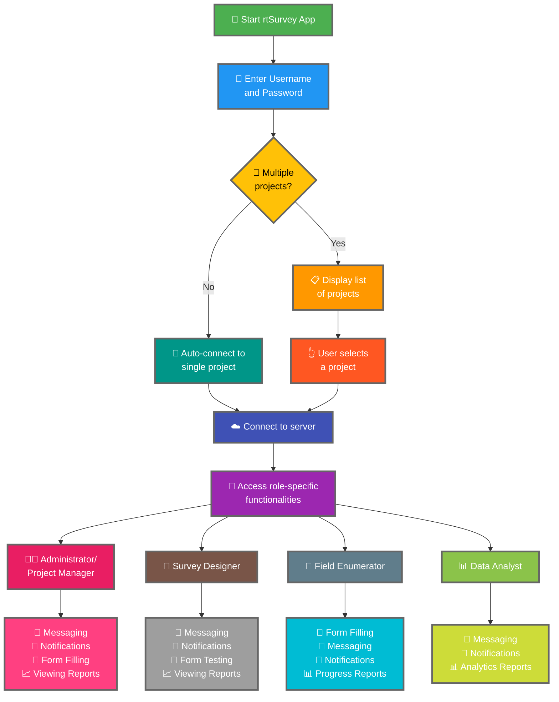

Підключення додатку rtSurvey до сервера є ключовим кроком для початку використання додатку для збору, управління та аналізу даних. Цей процес забезпечує можливість для всіх ролей опитування отримувати доступ до необхідних функцій і даних у реальному часі.

## Ключові відмінності від ODK Collect

rtSurvey пропонує розширені функції порівняно з ODK Collect, задовольняючи різні ролі в опитуванні:
- **Адміністратор**: Обмін повідомленнями, сповіщення про оновлення (відправлення даних, нові звіти, нові облікові записи), заповнення форм та перегляд аналітичних звітів.
- **Менеджер проекту**: Аналогічні функції, як у адміністраторів, включаючи налаштування та управління проектами.
- **Дизайнер опитування**: Обмін повідомленнями, сповіщення, заповнення форм та перегляд аналітичних звітів.
- **Польовий анкетер**: Заповнення форм, обмін повідомленнями, сповіщення та звіти про прогрес.
- **Аналітик даних**: Обмін повідомленнями, сповіщення та доступ до аналітичних звітів.

## Кроки для підключення додатку rtSurvey до сервера

### 1. Переконайтеся, що у вас є обліковий запис

Для підключення до сервера вам потрібен обліковий запис. Облікові записи може створити адміністратор або персонал за допомогою URL для створення облікового запису, налаштованого адміністратором.

### 2. Відкрийте додаток rtSurvey

Запустіть додаток rtSurvey на своєму мобільному пристрої. Якщо ви ще не встановили його, зверніться до сторінки [Встановлення додатку rtSurvey](#installing-rtsurvey-app).

### 3. Отримайте доступ до налаштувань підключення до сервера

1. Відкрийте додаток і перейдіть до меню налаштувань.
2. Виберіть параметр підключення до сервера.

### 4. Введіть деталі облікового запису та виберіть проект

При підключенні до rtSurvey процес спрощується залежно від конфігурації вашого облікового запису:

- **Ім'я користувача**: Введіть ім'я користувача вашого облікового запису.
- **Пароль**: Введіть пароль вашого облікового запису.

Після введення облікових даних:

- Якщо ваш обліковий запис пов'язаний лише з одним проектом опитування:
  - Додаток автоматично увійде на сервер цього проекту.
  - Вам не потрібно вводити URL сервера або вибирати проект вручну.

- Якщо ваш обліковий запис пов'язаний з кількома проектами опитування:
  - Після успішної аутентифікації ви побачите список проектів, до яких маєте доступ.
  - Виберіть проект, над яким хочете працювати, з цього списку.

### 5. Аутентифікуйтеся

Після введення деталей сервера натисніть кнопку «Підключитися» або «Увійти». Додаток перевірить ваші облікові дані та встановить з'єднання з сервером.

## Усунення проблем із підключенням

Якщо ви стикаєтеся з проблемами при підключенні до сервера:

1. **Перевірте підключення до Інтернету**: Переконайтеся, що ваш пристрій підключений до Інтернету.
2. **Підтвердіть облікові дані**: Переконайтеся, що ваше ім'я користувача та пароль правильні.
3. **Перезапустіть додаток**: Закрийте та знову відкрийте додаток rtSurvey.
4. **Зверніться за підтримкою**: Якщо проблеми зберігаються, зверніться до системного адміністратора або служби підтримки rtSurvey.

## Висновок

Підключення додатку rtSurvey до сервера є простим процесом, що дозволяє використовувати повні можливості додатку. Дотримуючись наведених вище кроків, ви можете забезпечити безперебійний збір даних, управління та аналіз, адаптовані до вашої конкретної ролі в опитуванні.
