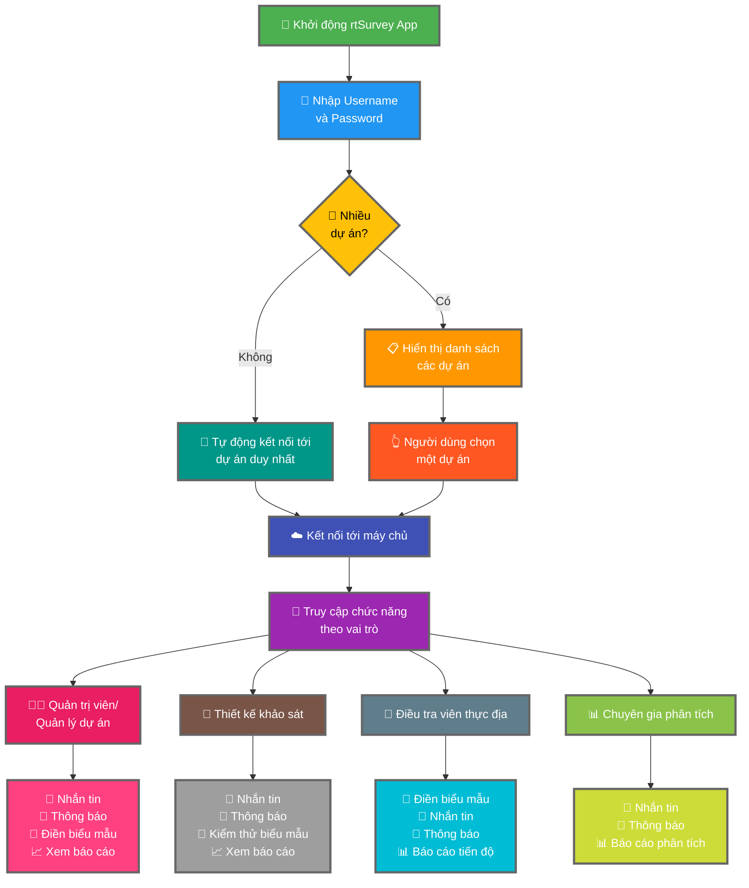

Kết nối ứng dụng rtSurvey với máy chủ là một bước quan trọng để bắt đầu sử dụng ứng dụng để thu thập, quản lý và phân tích dữ liệu. Quá trình này đảm bảo rằng tất cả các vai trò khảo sát đều có thể truy cập các chức năng và dữ liệu cần thiết trong thời gian thực.

## Những điểm khác biệt chính so với ODK Collect

rtSurvey cung cấp các chức năng nâng cao so với `ODK Collect`, phục vụ cho nhiều vai trò khảo sát khác nhau:
- **Administrator (Quản trị viên)**: Nhắn tin, thông báo cập nhật (gửi dữ liệu, báo cáo mới, tài khoản mới), điền biểu mẫu và xem các báo cáo phân tích.
- **Project Manager (Quản lý dự án)**: Các chức năng tương tự như Quản trị viên, bao gồm thiết lập và quản lý dự án.
- **Survey Designer (Thiết kế khảo sát)**: Nhắn tin, thông báo, điền biểu mẫu và xem các báo cáo phân tích.
- **Field Enumerator (Điều tra viên thực địa)**: Điền biểu mẫu, nhắn tin, thông báo và xem báo cáo tiến độ.
- **Data Analyst (Chuyên gia phân tích dữ liệu)**: Nhắn tin, thông báo và truy cập các báo cáo phân tích.

## Các bước kết nối rtSurvey App với Máy chủ

### 1. Đảm bảo bạn đã có tài khoản

Để kết nối với máy chủ, bạn cần một tài khoản. Tài khoản có thể được tạo bởi Quản trị viên (`Administrator`) hoặc bởi nhân viên sử dụng URL tạo tài khoản do Quản trị viên thiết lập.

### 2. Mở ứng dụng rtSurvey

Khởi chạy ứng dụng rtSurvey trên thiết bị di động của bạn. Nếu bạn chưa cài đặt, hãy tham khảo trang [Cài đặt ứng dụng rtSurvey](#installing-rtsurvey-app).

### 3. Truy cập Cài đặt Kết nối Máy chủ

1. Mở ứng dụng và điều hướng đến menu cài đặt.
2. Chọn tùy chọn để kết nối với máy chủ.

### 4. Nhập Chi tiết Tài khoản và Chọn Dự án

Khi kết nối với rtSurvey, quy trình được hợp lý hóa dựa trên cấu hình tài khoản của bạn:

- **Username**: Nhập tên đăng nhập tài khoản của bạn.
- **Password**: Nhập mật khẩu tài khoản của bạn.

Sau khi nhập thông tin đăng nhập:

- Nếu tài khoản của bạn chỉ liên kết với một dự án khảo sát:
  - Ứng dụng sẽ tự động đăng nhập bạn vào máy chủ của dự án đó.
  - Bạn không cần nhập URL máy chủ hoặc chọn dự án theo cách thủ công.

- Nếu tài khoản của bạn liên kết với nhiều dự án khảo sát:
  - Sau khi xác thực thành công, bạn sẽ thấy danh sách các dự án mà bạn có quyền truy cập.
  - Chọn dự án bạn muốn làm việc từ danh sách này.

### 5. Xác thực

Sau khi nhập chi tiết máy chủ, hãy nhấn vào nút "Kết nối" (`Connect`) hoặc "Đăng nhập" (`Login`). Ứng dụng sẽ xác thực thông tin đăng nhập của bạn và thiết lập kết nối tới máy chủ.

## Khắc phục sự cố kết nối

Nếu bạn gặp phải sự cố trong khi kết nối với máy chủ:

1. **Kiểm tra kết nối Internet**: Đảm bảo thiết bị của bạn được kết nối internet.
2. **Xác nhận thông tin đăng nhập**: Đảm bảo tên người dùng và mật khẩu của bạn là chính xác.
3. **Khởi động lại ứng dụng**: Đóng và mở lại ứng dụng rtSurvey.
4. **Liên hệ hỗ trợ**: Nếu sự cố vẫn tiếp diễn, hãy liên hệ với quản trị viên hệ thống của bạn hoặc bộ phận hỗ trợ rtSurvey để được trợ giúp.

## Kết luận

Kết nối ứng dụng rtSurvey với máy chủ là một quy trình đơn giản cho phép bạn tận dụng toàn bộ khả năng của ứng dụng. Bằng cách làm theo các bước nêu trên, bạn có thể đảm bảo quá trình thu thập, quản lý và phân tích dữ liệu diễn ra liền mạch, phù hợp với vai trò khảo sát cụ thể của mình.
