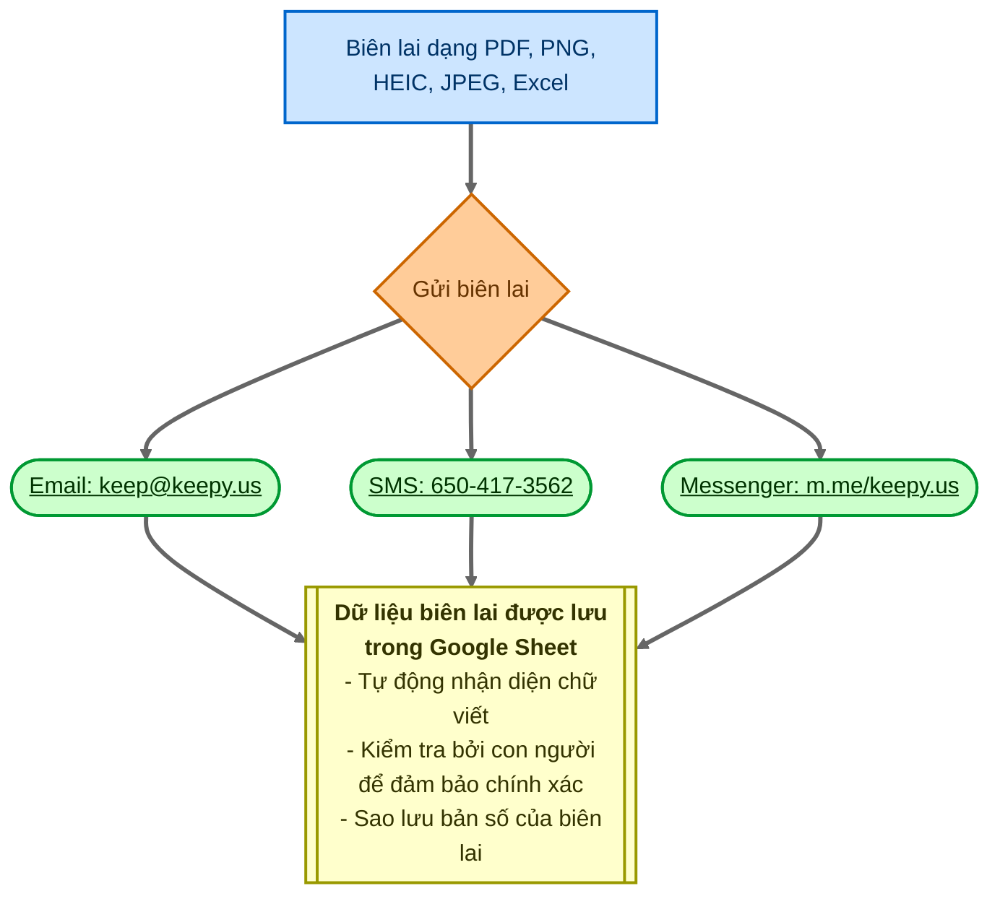

Tìm kiếm động (Dynamic Search) là một tính năng mạnh mẽ trong rtSurvey cho phép bạn tích hợp chức năng tìm kiếm động vào khảo sát của mình, cho phép truy xuất dữ liệu thời gian thực từ các nguồn bên ngoài.

## Cú pháp (Syntax)

Cú pháp cơ bản để sử dụng Search-API là:




### Các tham số (Parameters)

- `method`: Luôn luôn sử dụng 'POST'.
- `url`: URL để lấy dữ liệu.
- `post_body`: Thân yêu cầu (request body). Sử dụng cú pháp `searchView` (xem tài liệu DataModel Views).
- `value_column`: Trường dữ liệu được sử dụng làm giá trị (`value`).
- `display`: Trường dữ liệu được sử dụng làm nhãn (`label`). Hỗ trợ cú pháp kiểu mẫu (template) với `##key##` và `@{func}` để định dạng nâng cao.
- `data_path`: JSONPath để trích xuất dữ liệu mong muốn từ phản hồi (ví dụ: `$.hits.hits.*._source`).
- `save_path`: Vị trí để lưu trữ dữ liệu phản hồi để sử dụng sau này.

## Ví dụ sử dụng (Usage Examples)

### Cách dùng cơ bản

```
appearance: search-api('POST', 'https://api.example.com/search', '{"query": "%__input__%"}', 'id', 'name', '$.results', 'search_results')
```

### Với định dạng hiển thị nâng cao

```
appearance: search-api('POST', 'https://api.example.com/search', '{"query": "%__input__%"}', 'id', '##name## (##age## tuổi)', '$.results', 'search_results')
```

### Với Hàm trong phần hiển thị (Function in Display)

```
appearance: search-api('POST', 'https://api.example.com/search', '{"query": "%__input__%"}', 'id', '@{if_else(eq("##status##", "active"), "Hoạt động: ##name##", "Không hoạt động: ##name##")}', '$.results', 'search_results')
```

## Các loại câu hỏi hỗ trợ

- `select_one`
- `select_multiple`
- `text` (cho chức năng tự động hoàn thành - autocomplete)

## Các tính năng bổ sung

### API Mặc định (Default API)

Sử dụng `search-default-api()` sau `search-api()` để đặt các giá trị mặc định:

```
appearance: search-api(...) search-default-api(...)
```

### Ký tự phân tách đa lựa chọn (Multiple Selection Separator)

Đối với `select_multiple`, sử dụng `search-default-separator()` để chỉ định ký tự phân tách tùy chỉnh:

```
appearance: search-api(...) search-default-separator(' || ')
```

## Thực hành tốt nhất (Best Practices)

1. Tối ưu hóa các điểm cuối API (API endpoints) để đạt hiệu suất cao, đặc biệt là với các tập dữ liệu lớn.
2. Sử dụng các chiến lược lưu trữ đệm (caching) phù hợp để giảm số lượng lệnh gọi API.
3. Xử lý các lỗi mạng một cách mượt mà trong thiết kế khảo sát của bạn.
4. Kiểm tra kỹ lưỡng với các kịch bản đầu vào khác nhau.

## Các hạn chế đã biết

- Các truy vấn phức tạp có thể ảnh hưởng đến thời gian tải khảo sát.
- Chức năng ngoại tuyến có thể bị hạn chế tùy thuộc vào cách triển khai.


