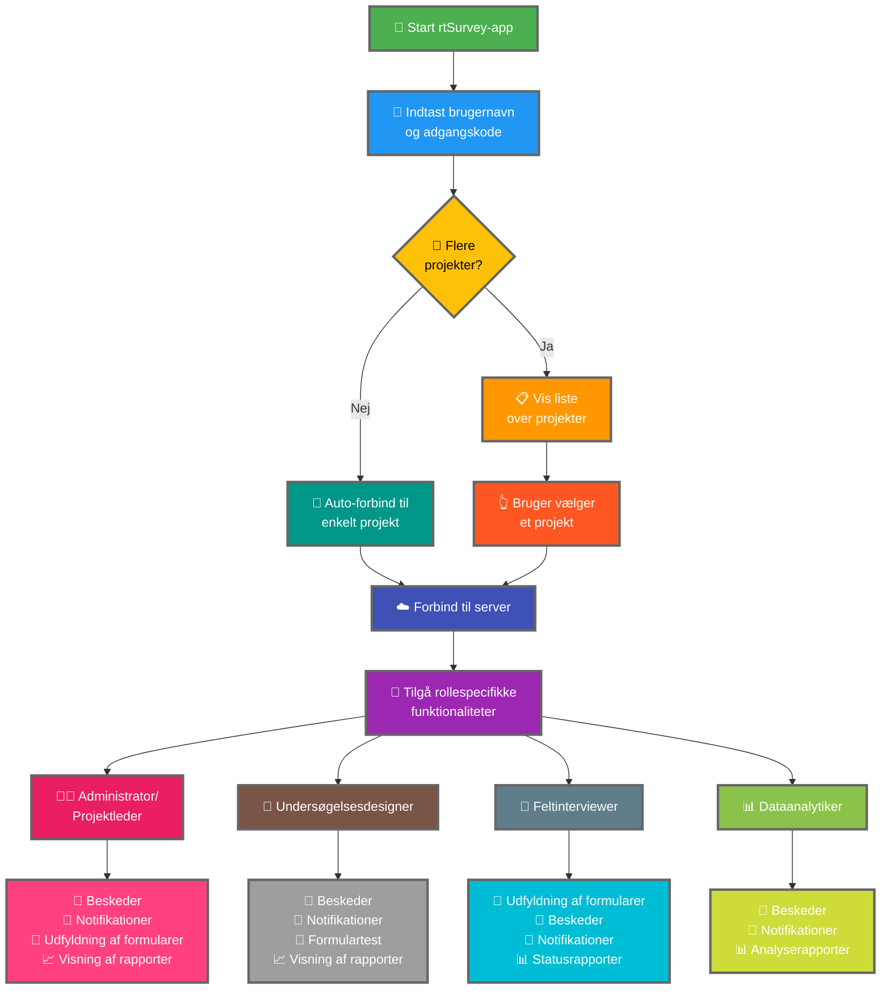

Forbindelsen af rtSurvey-appen til en server er et afgørende skridt for at begynde at bruge appen til dataindsamling, -administration og -analyse. Denne proces sikrer, at alle undersøgelsesroller kan tilgå de nødvendige funktionaliteter og data i realtid.

## Vigtige forskelle fra ODK Collect

rtSurvey tilbyder forbedrede funktionaliteter sammenlignet med ODK Collect og imødekommer forskellige undersøgelsesroller:
- **Administrator**: Beskeder, notifikationer om opdateringer (dataindsendelse, nye rapporter, nye konti), udfyldning af formularer og visning af analyserapporter.
- **Projektleder**: Lignende funktionaliteter som administratorer, herunder projektopsætning og -administration.
- **Undersøgelsesdesigner**: Beskeder, notifikationer, udfyldning af formularer og visning af analyserapporter.
- **Feltinterviewer**: Udfyldning af formularer, beskeder, notifikationer og statusrapporter.
- **Dataanalytiker**: Beskeder, notifikationer og adgang til analyserapporter.

## Trin til at forbinde rtSurvey-appen til en server

### 1. Sørg for, at du har en konto

For at forbinde til serveren har du brug for en konto. Konti kan oprettes af en administrator eller af personale ved hjælp af en kontooprettelse-URL opsat af administratoren.

### 2. Åbn rtSurvey-appen

Start rtSurvey-appen på din mobilenhed. Hvis du endnu ikke har installeret den, se siden [Installation af rtSurvey-appen](#installing-rtsurvey-app).

### 3. Tilgå serverforbinaelseindstillingerne

1. Åbn appen og naviger til indstillingsmenuen.
2. Vælg muligheden for at oprette forbindelse til en server.

### 4. Indtast kontooplysninger og vælg projekt

Når du forbinder til rtSurvey, er processen strømlinet baseret på din kontokonfiguration:

- **Brugernavn**: Indtast dit kontobrugernavn.
- **Adgangskode**: Indtast din kontoadgangskode.

Efter indtastning af dine legitimationsoplysninger:

- Hvis din konto kun er knyttet til ét undersøgelsesprojekt:
  - Appen logger dig automatisk ind på det pågældende projekts server.
  - Du behøver ikke indtaste en server-URL eller manuelt vælge et projekt.

- Hvis din konto er knyttet til flere undersøgelsesprojekter:
  - Efter vellykket godkendelse vises en liste over de projekter, du har adgang til.
  - Vælg det projekt, du vil arbejde på, fra denne liste.

### 5. Godkend

Efter indtastning af serverdetaljerne skal du trykke på knappen "Forbind" eller "Log ind". Appen godkender dine legitimationsoplysninger og opretter forbindelse til serveren.

## Fejlfinding af forbindelsesproblemer

Hvis du oplever problemer ved forbindelsen til serveren:

1. **Kontrollér internetforbindelsen**: Sørg for, at din enhed er forbundet til internettet.
2. **Bekræft legitimationsoplysninger**: Sørg for, at dit brugernavn og din adgangskode er korrekte.
3. **Genstart appen**: Luk og genåbn rtSurvey-appen.
4. **Kontakt support**: Hvis problemerne fortsætter, skal du kontakte din systemadministrator eller rtSurvey-support for assistance.

## Konklusion

Forbindelsen af rtSurvey-appen til en server er en enkel proces, der giver dig mulighed for at udnytte appens fulde kapaciteter. Ved at følge trinene beskrevet ovenfor kan du sikre problemfri dataindsamling, -administration og -analyse tilpasset din specifikke undersøgelsesrolle.
