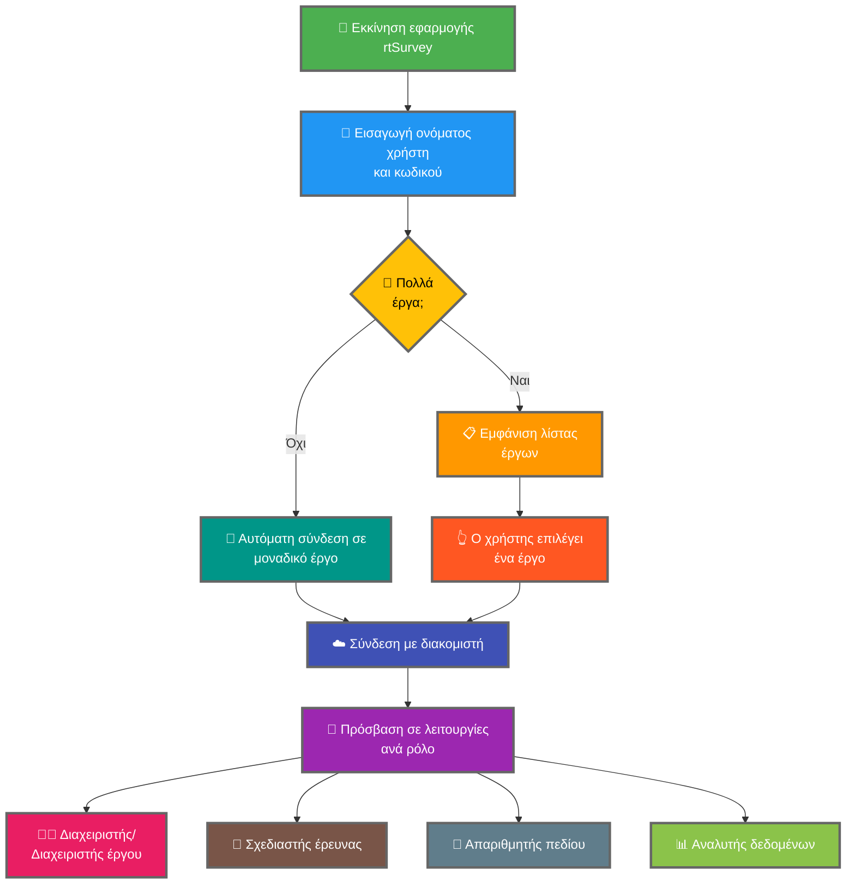

Η σύνδεση της εφαρμογής rtSurvey με διακομιστή είναι κρίσιμο βήμα για να ξεκινήσετε να χρησιμοποιείτε την εφαρμογή για συλλογή δεδομένων, διαχείριση και ανάλυση. Αυτή η διαδικασία διασφαλίζει ότι όλοι οι ρόλοι έρευνας έχουν πρόσβαση στις απαραίτητες λειτουργίες και δεδομένα σε πραγματικό χρόνο.

## Βασικές διαφορές από το ODK Collect

Το rtSurvey προσφέρει βελτιωμένες λειτουργίες σε σύγκριση με το ODK Collect, εξυπηρετώντας διάφορους ρόλους έρευνας:
- **Διαχειριστής**: Ανταλλαγή μηνυμάτων, ειδοποιήσεις για ενημερώσεις (υποβολή δεδομένων, νέες αναφορές, νέοι λογαριασμοί), συμπλήρωση φόρμας και προβολή αναφορών ανάλυσης.
- **Διαχειριστής έργου**: Παρόμοιες λειτουργίες με διαχειριστές, συμπεριλαμβανομένης ρύθμισης και διαχείρισης έργου.
- **Σχεδιαστής έρευνας**: Ανταλλαγή μηνυμάτων, ειδοποιήσεις, συμπλήρωση φόρμας και προβολή αναφορών ανάλυσης.
- **Απαριθμητής πεδίου**: Συμπλήρωση φόρμας, ανταλλαγή μηνυμάτων, ειδοποιήσεις και αναφορές προόδου.
- **Αναλυτής δεδομένων**: Ανταλλαγή μηνυμάτων, ειδοποιήσεις και πρόσβαση σε αναφορές αναλύσεων.

## Βήματα σύνδεσης εφαρμογής rtSurvey με διακομιστή

### 1. Βεβαιωθείτε ότι έχετε λογαριασμό

Για σύνδεση με τον διακομιστή, χρειάζεστε λογαριασμό. Οι λογαριασμοί μπορούν να δημιουργηθούν από Διαχειριστή ή από προσωπικό χρησιμοποιώντας URL δημιουργίας λογαριασμού που έχει ρυθμίσει ο Διαχειριστής.

### 2. Ανοίξτε την εφαρμογή rtSurvey

Εκκινήστε την εφαρμογή rtSurvey στη κινητή συσκευή σας. Εάν δεν την έχετε εγκαταστήσει ακόμα, ανατρέξτε στη σελίδα [Εγκατάσταση εφαρμογής rtSurvey](#installing-rtsurvey-app).

### 3. Πρόσβαση στις ρυθμίσεις σύνδεσης διακομιστή

1. Ανοίξτε την εφαρμογή και πλοηγηθείτε στο μενού ρυθμίσεων.
2. Επιλέξτε την επιλογή σύνδεσης με διακομιστή.

### 4. Εισαγωγή στοιχείων λογαριασμού και επιλογή έργου

Κατά τη σύνδεση στο rtSurvey, η διαδικασία είναι απλοποιημένη βάσει της διαμόρφωσης του λογαριασμού σας:

- **Όνομα χρήστη**: Εισαγάγετε το όνομα χρήστη λογαριασμού σας.
- **Κωδικός**: Εισαγάγετε τον κωδικό λογαριασμού σας.

Μετά την εισαγωγή διαπιστευτηρίων:

- Εάν ο λογαριασμός σας σχετίζεται με ένα μόνο έργο έρευνας:
  - Η εφαρμογή θα σας συνδέσει αυτόματα στον διακομιστή εκείνου του έργου.
  - Δεν χρειάζεται να εισαγάγετε URL διακομιστή ή να επιλέξετε έργο χειροκίνητα.

- Εάν ο λογαριασμός σας σχετίζεται με πολλά έργα έρευνας:
  - Μετά την επιτυχή ταυτοποίηση, θα δείτε λίστα έργων στα οποία έχετε πρόσβαση.
  - Επιλέξτε το έργο στο οποίο θέλετε να εργαστείτε από αυτή τη λίστα.

### 5. Ταυτοποίηση

Μετά την εισαγωγή στοιχείων διακομιστή, πατήστε το κουμπί "Σύνδεση" ή "Είσοδος". Η εφαρμογή θα ταυτοποιήσει τα διαπιστευτήριά σας και θα δημιουργήσει σύνδεση με τον διακομιστή.

## Αντιμετώπιση προβλημάτων σύνδεσης

Εάν αντιμετωπίσετε προβλήματα κατά τη σύνδεση με τον διακομιστή:

1. **Έλεγχος σύνδεσης Διαδικτύου**: Βεβαιωθείτε ότι η συσκευή σας είναι συνδεδεμένη στο Διαδίκτυο.
2. **Επιβεβαίωση διαπιστευτηρίων**: Βεβαιωθείτε ότι το όνομα χρήστη και ο κωδικός σας είναι σωστά.
3. **Επανεκκίνηση εφαρμογής**: Κλείστε και ανοίξτε ξανά την εφαρμογή rtSurvey.
4. **Επικοινωνία με υποστήριξη**: Εάν τα προβλήματα παραμένουν, επικοινωνήστε με τον διαχειριστή συστήματος ή υποστήριξη rtSurvey.

## Συμπέρασμα

Η σύνδεση της εφαρμογής rtSurvey με διακομιστή είναι απλή διαδικασία που σας δίνει τη δυνατότητα να αξιοποιήσετε τις πλήρεις δυνατότητες της εφαρμογής. Ακολουθώντας τα παραπάνω βήματα, μπορείτε να εξασφαλίσετε απρόσκοπτη συλλογή δεδομένων, διαχείριση και ανάλυση προσαρμοσμένη στον συγκεκριμένο ρόλο έρευνας σας.
