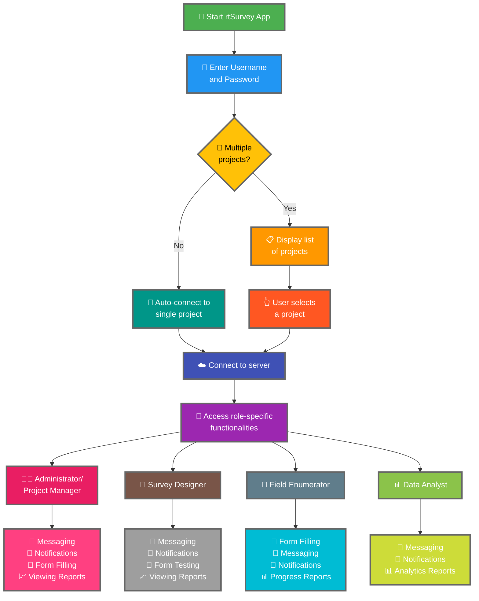

Connettere l'app rtSurvey a un server è un passaggio cruciale per iniziare a usare l'app per la raccolta dati, la gestione e l'analisi. Questo processo garantisce che tutti i ruoli del sondaggio possano accedere alle funzionalità e ai dati necessari in tempo reale.

## Differenze chiave rispetto a ODK Collect

rtSurvey offre funzionalità avanzate rispetto a ODK Collect, per i vari ruoli del sondaggio:
- **Amministratore**: Messaggistica, notifiche per gli aggiornamenti (invio dati, nuovi report, nuovi account), compilazione moduli e visualizzazione dei report di analisi.
- **Responsabile di progetto**: Funzionalità simili agli Amministratori, inclusa la configurazione e la gestione del progetto.
- **Progettista di sondaggi**: Messaggistica, notifiche, compilazione moduli e visualizzazione dei report di analisi.
- **Intervistatore sul campo**: Compilazione moduli, messaggistica, notifiche e report di avanzamento.
- **Analista di dati**: Messaggistica, notifiche e accesso ai report di analisi.

## Passaggi per connettere l'app rtSurvey a un server

### 1. Assicurati di avere un account

Per connetterti al server, hai bisogno di un account. Gli account possono essere creati da un Amministratore o dal personale usando un URL di creazione account impostato dall'Amministratore.

### 2. Apri l'app rtSurvey

Avvia l'app rtSurvey sul tuo dispositivo mobile. Se non l'hai ancora installata, consulta la pagina [Installazione dell'app rtSurvey](#installing-rtsurvey-app).

### 3. Accedi alle impostazioni di connessione al server

1. Apri l'app e vai al menu delle impostazioni.
2. Seleziona l'opzione per connetterti a un server.

### 4. Inserisci i dettagli dell'account e seleziona il progetto

Quando ti connetti a rtSurvey, il processo è semplificato in base alla configurazione del tuo account:

- **Nome utente**: Inserisci il nome utente del tuo account.
- **Password**: Inserisci la password del tuo account.

Dopo aver inserito le credenziali:

- Se il tuo account è associato a un solo progetto di sondaggio:
  - L'app ti accederà automaticamente al server di quel progetto.
  - Non devi inserire un URL del server o selezionare un progetto manualmente.

- Se il tuo account è associato a più progetti di sondaggio:
  - Dopo l'autenticazione riuscita, vedrai un elenco dei progetti a cui hai accesso.
  - Seleziona il progetto su cui vuoi lavorare da questo elenco.

### 5. Autenticati

Dopo aver inserito i dettagli del server, tocca il pulsante "Connetti" o "Accedi". L'app autenticherà le tue credenziali e stabilirà una connessione al server.

## Risoluzione dei problemi di connessione

Se incontri problemi durante la connessione al server:

1. **Controlla la connessione Internet**: Assicurati che il tuo dispositivo sia connesso a Internet.
2. **Conferma le credenziali**: Assicurati che il nome utente e la password siano corretti.
3. **Riavvia l'app**: Chiudi e riapri l'app rtSurvey.
4. **Contatta il supporto**: Se i problemi persistono, contatta il tuo amministratore di sistema o il supporto rtSurvey per assistenza.

## Conclusione

Connettere l'app rtSurvey a un server è un processo semplice che ti permette di sfruttare le piene capacità dell'app. Seguendo i passaggi descritti sopra, puoi garantire una raccolta dati, gestione e analisi senza problemi adattata al tuo specifico ruolo nel sondaggio.
