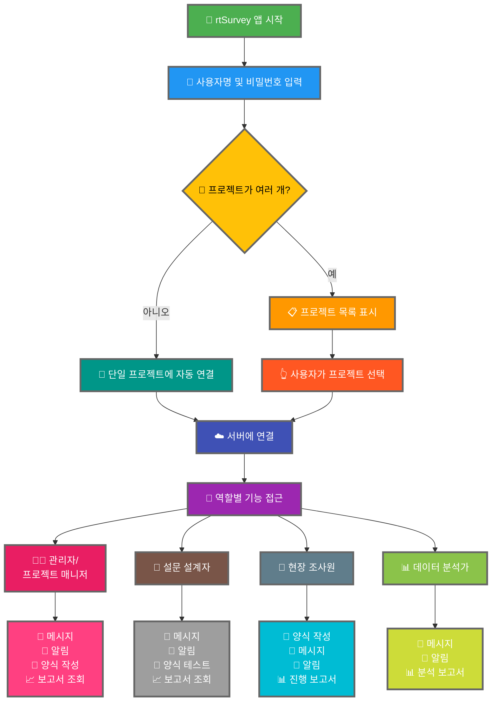

rtSurvey 앱을 서버에 연결하는 것은 데이터 수집, 관리 및 분석에 앱을 사용하기 시작하는 중요한 단계입니다. 이 과정을 통해 모든 설문 역할이 필요한 기능과 데이터에 실시간으로 접근할 수 있게 됩니다.

## ODK Collect와의 주요 차이점

rtSurvey는 ODK Collect에 비해 향상된 기능을 제공하여 다양한 설문 역할에 맞게 제공됩니다:
- **관리자**: 메시지, 업데이트 알림(데이터 제출, 새 보고서, 새 계정), 양식 작성 및 분석 보고서 조회.
- **프로젝트 매니저**: 프로젝트 설정 및 관리를 포함하여 관리자와 유사한 기능.
- **설문 설계자**: 메시지, 알림, 양식 작성 및 분석 보고서 조회.
- **현장 조사원**: 양식 작성, 메시지, 알림 및 진행 보고서.
- **데이터 분석가**: 메시지, 알림 및 분석 보고서 접근.

## rtSurvey 앱을 서버에 연결하는 단계

### 1. 계정이 있는지 확인

서버에 연결하려면 계정이 필요합니다. 계정은 관리자가 만들거나 관리자가 설정한 계정 생성 URL을 사용하여 직원이 만들 수 있습니다.

### 2. rtSurvey 앱 열기

모바일 기기에서 rtSurvey 앱을 실행합니다. 아직 설치하지 않은 경우 [rtSurvey 앱 설치](#installing-rtsurvey-app) 페이지를 참조하세요.

### 3. 서버 연결 설정 접근

1. 앱을 열고 설정 메뉴로 이동합니다.
2. 서버에 연결하는 옵션을 선택합니다.

### 4. 계정 세부 정보 입력 및 프로젝트 선택

rtSurvey에 연결할 때 계정 구성에 따라 프로세스가 간소화됩니다:

- **사용자명**: 계정 사용자명을 입력합니다.
- **비밀번호**: 계정 비밀번호를 입력합니다.

자격 증명 입력 후:

- 계정이 하나의 설문 프로젝트에만 연결된 경우:
  - 앱이 해당 프로젝트의 서버에 자동으로 로그인합니다.
  - 서버 URL을 입력하거나 프로젝트를 수동으로 선택할 필요가 없습니다.

- 계정이 여러 설문 프로젝트에 연결된 경우:
  - 성공적으로 인증되면 접근 권한이 있는 프로젝트 목록이 표시됩니다.
  - 이 목록에서 작업할 프로젝트를 선택합니다.

### 5. 인증

서버 세부 정보를 입력한 후 "연결" 또는 "로그인" 버튼을 탭합니다. 앱이 자격 증명을 인증하고 서버에 연결을 설정합니다.

## 연결 문제 해결

서버에 연결하는 동안 문제가 발생하면:

1. **인터넷 연결 확인**: 기기가 인터넷에 연결되어 있는지 확인합니다.
2. **자격 증명 확인**: 사용자명과 비밀번호가 정확한지 확인합니다.
3. **앱 재시작**: rtSurvey 앱을 닫고 다시 엽니다.
4. **지원 연락**: 문제가 지속되면 시스템 관리자 또는 rtSurvey 지원팀에 문의하세요.

## 결론

rtSurvey 앱을 서버에 연결하는 것은 앱의 전체 기능을 활용할 수 있게 해주는 간단한 프로세스입니다. 위에 설명된 단계를 따르면 특정 설문 역할에 맞춤화된 원활한 데이터 수집, 관리 및 분석을 보장할 수 있습니다.
