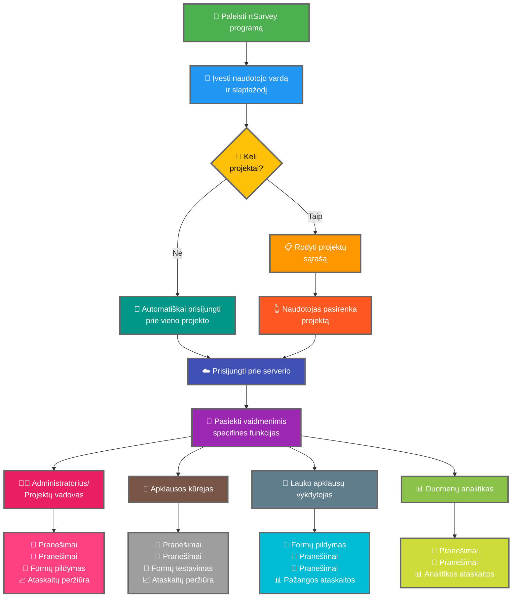

rtSurvey programos prijungimas prie serverio yra esminis žingsnis pradedant naudoti programą duomenų rinkimui, valdymui ir analizei. Šis procesas užtikrina, kad visi apklausos vaidmenys galėtų realiuoju laiku pasiekti reikalingas funkcijas ir duomenis.

## Pagrindiniai skirtumai nuo ODK Collect

rtSurvey siūlo patobulintas funkcijas, palyginti su ODK Collect, pritaikydama įvairių apklausos vaidmenų poreikiams:
- **Administratorius**: pranešimų siuntimas, pranešimai apie naujinimus (duomenų pateikimas, naujos ataskaitos, naujos paskyros), formų pildymas ir analizės ataskaitų peržiūra.
- **Projektų vadovas**: panašios funkcijos kaip administratorių, įskaitant projekto sąranką ir valdymą.
- **Apklausos kūrėjas**: pranešimų siuntimas, pranešimai, formų pildymas ir analizės ataskaitų peržiūra.
- **Lauko apklausų vykdytojas**: formų pildymas, pranešimų siuntimas, pranešimai ir pažangos ataskaitos.
- **Duomenų analitikas**: pranešimų siuntimas, pranešimai ir prieiga prie analitikos ataskaitų.

## rtSurvey programos prisijungimo prie serverio veiksmai

### 1. Įsitikinkite, kad turite paskyrą

Norėdami prisijungti prie serverio, jums reikia paskyros. Paskyras gali kurti administratorius arba darbuotojai naudodami administratoriaus sukurtą paskyros kūrimo URL.

### 2. Atidarykite rtSurvey programą

Paleiskite rtSurvey programą savo mobiliajame įrenginyje. Jei jos dar neįdiegėte, žr. puslapį [rtSurvey programos diegimas](#installing-rtsurvey-app).

### 3. Pasiekite serverio ryšio nustatymus

1. Atidarykite programą ir pereikite į nustatymų meniu.
2. Pasirinkite parinktį prisijungti prie serverio.

### 4. Įveskite paskyros duomenis ir pasirinkite projektą

Prisijungiant prie rtSurvey, procesas supaprastintas pagal jūsų paskyros konfigūraciją:

- **Naudotojo vardas**: įveskite savo paskyros naudotojo vardą.
- **Slaptažodis**: įveskite savo paskyros slaptažodį.

Įvedę prisijungimo duomenis:

- Jei jūsų paskyra susieta su tik vienu apklausos projektu:
  - Programa automatiškai prisiregistruos prie to projekto serverio.
  - Serverio URL įvesti arba projekto pasirinkti neautomatiniu būdu nereikia.

- Jei jūsų paskyra susieta su keliais apklausos projektais:
  - Po sėkmingo autentifikavimo pamatysite projektų, prie kurių turite prieigą, sąrašą.
  - Pasirinkite projektą, su kuriuo norite dirbti, iš šio sąrašo.

### 5. Autentifikavimas

Įvedę serverio duomenis, bakstelėkite mygtuką „Prisijungti". Programa autentifikuos jūsų prisijungimo duomenis ir nustatys ryšį su serveriu.

## Ryšio problemų sprendimas

Jei susiduriate su problemomis prisijungiant prie serverio:

1. **Patikrinkite interneto ryšį**: įsitikinkite, kad jūsų įrenginys yra prijungtas prie interneto.
2. **Patvirtinkite prisijungimo duomenis**: įsitikinkite, kad jūsų naudotojo vardas ir slaptažodis yra teisingi.
3. **Iš naujo paleiskite programą**: uždarykite ir vėl atidarykite rtSurvey programą.
4. **Susisiekite su palaikymu**: jei problemos išlieka, susisiekite su savo sistemos administratoriumi arba rtSurvey palaikymu.

## Išvada

rtSurvey programos prijungimas prie serverio yra paprastas procesas, leidžiantis jums išnaudoti visas programos galimybes. Atlikdami aukščiau aprašytus veiksmus, galite užtikrinti sklandų duomenų rinkimą, valdymą ir analizę, pritaikytą jūsų konkrečiam apklausos vaidmeniui.
