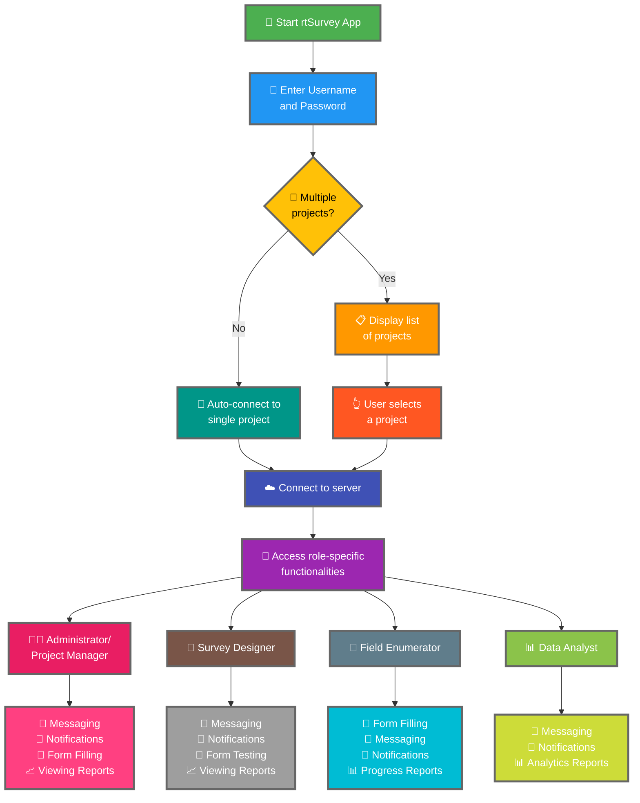

Het verbinden van de rtSurvey-app met een server is een cruciale stap om de app te gaan gebruiken voor gegevensverzameling, -beheer en -analyse. Dit proces zorgt ervoor dat alle enquêterollen in realtime toegang hebben tot de benodigde functionaliteiten en gegevens.

## Belangrijkste verschillen met ODK Collect

rtSurvey biedt verbeterde functionaliteiten vergeleken met ODK Collect, gericht op verschillende enquêterollen:
- **Beheerder**: Berichten, meldingen voor updates (gegevensinzending, nieuwe rapporten, nieuwe accounts), formulieren invullen en analyserapporten bekijken.
- **Projectmanager**: Vergelijkbare functionaliteiten als beheerders, inclusief projectopzet en -beheer.
- **Enquêteontwerper**: Berichten, meldingen, formulieren invullen en analyserapporten bekijken.
- **Veldenquêteur**: Formulieren invullen, berichten, meldingen en voortgangsrapporten.
- **Data-analist**: Berichten, meldingen en toegang tot analyserapporten.

## Stappen om de rtSurvey App te verbinden met een server

### 1. Zorg ervoor dat u een account heeft

Om verbinding te maken met de server, heeft u een account nodig. Accounts kunnen worden aangemaakt door een Beheerder of door personeel via een accountaanmaak-URL die is ingesteld door de Beheerder.

### 2. Open de rtSurvey App

Start de rtSurvey-app op uw mobiele apparaat. Als u deze nog niet heeft geïnstalleerd, raadpleeg dan de pagina [rtSurvey App installeren](#installing-rtsurvey-app).

### 3. Toegang tot de serververbindingsinstellingen

1. Open de app en navigeer naar het instellingenmenu.
2. Selecteer de optie om verbinding te maken met een server.

### 4. Accountgegevens invoeren en project selecteren

Bij het verbinden met rtSurvey is het proces gestroomlijnd op basis van uw accountconfiguratie:

- **Gebruikersnaam**: Voer uw accountgebruikersnaam in.
- **Wachtwoord**: Voer uw accountwachtwoord in.

Na het invoeren van uw gegevens:

- Als uw account is gekoppeld aan slechts één enquêteproject:
  - De app logt u automatisch in op de server van dat project.
  - U hoeft geen server-URL in te voeren of een project handmatig te selecteren.

- Als uw account is gekoppeld aan meerdere enquêteprojecten:
  - Na succesvolle authenticatie ziet u een lijst met projecten waartoe u toegang heeft.
  - Selecteer het project waaraan u wilt werken uit deze lijst.

### 5. Authenticeren

Na het invoeren van de servergegevens tikt u op de knop "Verbinden" of "Inloggen". De app authenticeert uw gegevens en maakt verbinding met de server.

## Verbindingsproblemen oplossen

Als u problemen ondervindt bij het verbinden met de server:

1. **Controleer de internetverbinding**: Zorg ervoor dat uw apparaat is verbonden met het internet.
2. **Bevestig gegevens**: Zorg ervoor dat uw gebruikersnaam en wachtwoord correct zijn.
3. **Herstart de app**: Sluit de rtSurvey-app en open deze opnieuw.
4. **Neem contact op met ondersteuning**: Als problemen aanhouden, neem dan contact op met uw systeembeheerder of rtSurvey-ondersteuning voor hulp.

## Conclusie

Het verbinden van de rtSurvey-app met een server is een eenvoudig proces dat u in staat stelt de volledige mogelijkheden van de app te benutten. Door de bovenstaande stappen te volgen, zorgt u voor naadloze gegevensverzameling, -beheer en -analyse afgestemd op uw specifieke enquêterol.
