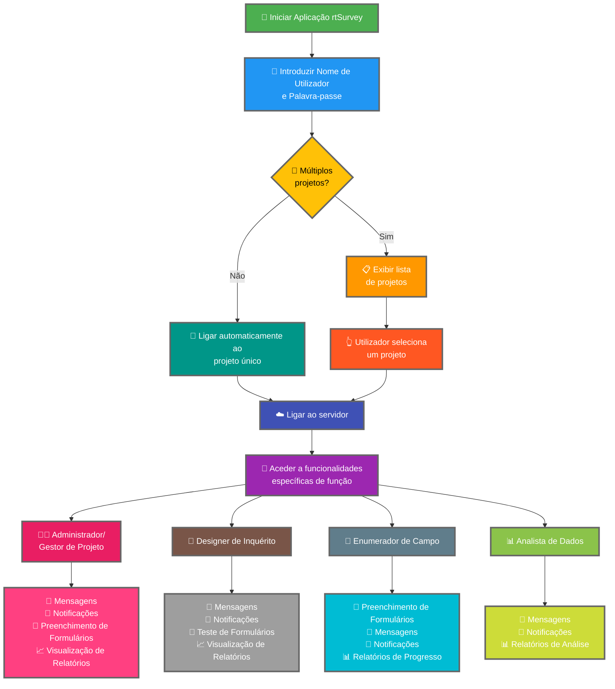

Ligar a aplicação rtSurvey a um servidor é um passo crucial para começar a usar a aplicação para recolha, gestão e análise de dados. Este processo garante que todas as funções de inquérito podem aceder às funcionalidades e dados necessários em tempo real.

## Diferenças Principais em Relação ao ODK Collect

O rtSurvey oferece funcionalidades melhoradas em comparação com o ODK Collect, atendendo a várias funções de inquérito:
- **Administrador**: Mensagens, notificações de atualizações (submissão de dados, novos relatórios, novas contas), preenchimento de formulários e visualização de relatórios de análise.
- **Gestor de Projeto**: Funcionalidades semelhantes às dos Administradores, incluindo configuração e gestão de projetos.
- **Designer de Inquérito**: Mensagens, notificações, preenchimento de formulários e visualização de relatórios de análise.
- **Enumerador de Campo**: Preenchimento de formulários, mensagens, notificações e relatórios de progresso.
- **Analista de Dados**: Mensagens, notificações e acesso a relatórios de análise.

## Passos para Ligar a Aplicação rtSurvey a um Servidor

### 1. Certifique-se de que Tem uma Conta

Para ligar ao servidor, precisa de uma conta. As contas podem ser criadas por um Administrador ou pelo pessoal usando um URL de criação de conta configurado pelo Administrador.

### 2. Abrir a Aplicação rtSurvey

Lance a aplicação rtSurvey no seu dispositivo móvel. Se ainda não a instalou, consulte a página [Instalar a Aplicação rtSurvey](#installing-rtsurvey-app).

### 3. Aceder às Configurações de Ligação ao Servidor

1. Abra a aplicação e navegue até ao menu de configurações.
2. Selecione a opção para ligar a um servidor.

### 4. Introduzir Detalhes da Conta e Selecionar Projeto

Ao ligar ao rtSurvey, o processo é simplificado com base na configuração da sua conta:

- **Nome de utilizador**: Introduza o nome de utilizador da sua conta.
- **Palavra-passe**: Introduza a palavra-passe da sua conta.

Após introduzir as suas credenciais:

- Se a sua conta estiver associada a apenas um projeto de inquérito:
  - A aplicação iniciará sessão automaticamente no servidor desse projeto.
  - Não precisa de introduzir um URL de servidor ou selecionar um projeto manualmente.

- Se a sua conta estiver associada a múltiplos projetos de inquérito:
  - Após autenticação com sucesso, verá uma lista dos projetos a que tem acesso.
  - Selecione o projeto em que pretende trabalhar a partir desta lista.

### 5. Autenticar

Após introduzir os detalhes do servidor, toque no botão "Ligar" ou "Iniciar sessão". A aplicação autenticará as suas credenciais e estabelecerá uma ligação ao servidor.

## Resolução de Problemas de Ligação

Se encontrar problemas ao ligar ao servidor:

1. **Verificar Ligação à Internet**: Certifique-se de que o seu dispositivo está ligado à internet.
2. **Confirmar Credenciais**: Certifique-se de que o seu nome de utilizador e palavra-passe estão corretos.
3. **Reiniciar a Aplicação**: Feche e reabra a aplicação rtSurvey.
4. **Contactar Suporte**: Se os problemas persistirem, contacte o seu administrador de sistema ou o suporte do rtSurvey para assistência.

## Conclusão

Ligar a aplicação rtSurvey a um servidor é um processo simples que lhe permite aproveitar as capacidades completas da aplicação. Seguindo os passos descritos acima, pode garantir uma recolha, gestão e análise de dados sem problemas, adaptada à sua função específica de inquérito.
