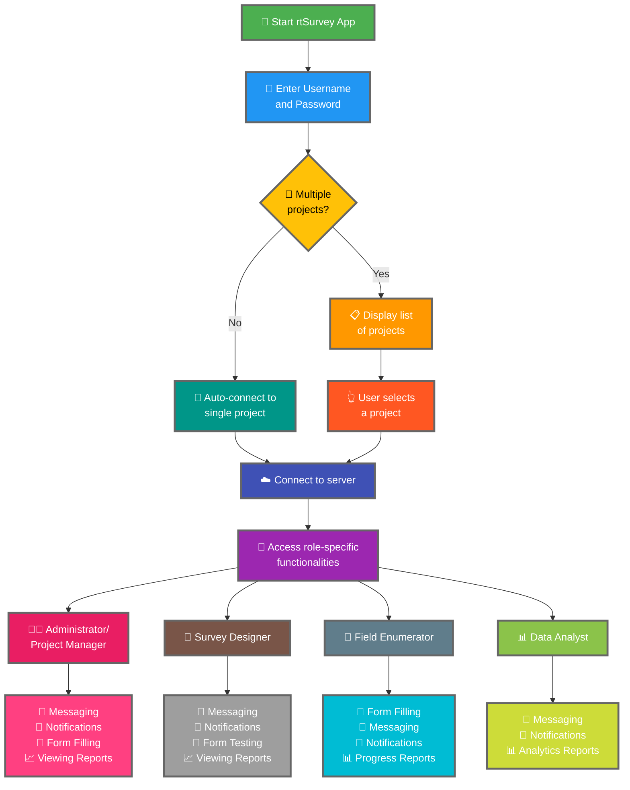

Подключение приложения rtSurvey к серверу — важный шаг для начала использования приложения для сбора данных, управления и анализа. Этот процесс обеспечивает доступ всех участников опроса к необходимым функциям и данным в реальном времени.

## Ключевые отличия от ODK Collect

rtSurvey предлагает расширенные возможности по сравнению с ODK Collect, учитывающие различные роли в опросе:
- **Администратор**: Обмен сообщениями, уведомления об обновлениях (отправка данных, новые отчёты, новые учётные записи), заполнение форм и просмотр аналитических отчётов.
- **Менеджер проекта**: Аналогичные функции, как у администраторов, включая настройку и управление проектами.
- **Дизайнер опросов**: Обмен сообщениями, уведомления, заполнение форм и просмотр аналитических отчётов.
- **Полевой интервьюер**: Заполнение форм, обмен сообщениями, уведомления и отчёты о прогрессе.
- **Аналитик данных**: Обмен сообщениями, уведомления и доступ к аналитическим отчётам.

## Шаги подключения приложения rtSurvey к серверу

### 1. Убедитесь, что у вас есть учётная запись

Для подключения к серверу необходима учётная запись. Учётные записи могут создаваться администратором или сотрудниками по URL для создания учётных записей, настроенному администратором.

### 2. Откройте приложение rtSurvey

Запустите приложение rtSurvey на мобильном устройстве. Если вы ещё не установили его, обратитесь к странице [Установка приложения rtSurvey](#installing-rtsurvey-app).

### 3. Откройте настройки подключения к серверу

1. Откройте приложение и перейдите в меню настроек.
2. Выберите опцию подключения к серверу.

### 4. Введите данные учётной записи и выберите проект

При подключении к rtSurvey процесс упрощён в зависимости от конфигурации вашей учётной записи:

- **Имя пользователя**: Введите имя учётной записи.
- **Пароль**: Введите пароль учётной записи.

После ввода учётных данных:

- Если ваша учётная запись связана только с одним проектом опроса:
  - Приложение автоматически выполнит вход на сервер этого проекта.
  - Вводить URL сервера или выбирать проект вручную не нужно.

- Если ваша учётная запись связана с несколькими проектами опроса:
  - После успешной аутентификации вы увидите список доступных проектов.
  - Выберите проект, с которым хотите работать.

### 5. Аутентификация

После ввода данных сервера нажмите кнопку «Подключить» или «Войти». Приложение аутентифицирует ваши учётные данные и установит подключение к серверу.

## Устранение проблем с подключением

При возникновении проблем с подключением к серверу:

1. **Проверьте подключение к интернету**: Убедитесь, что устройство подключено к сети.
2. **Проверьте учётные данные**: Убедитесь в правильности имени пользователя и пароля.
3. **Перезапустите приложение**: Закройте и снова откройте приложение rtSurvey.
4. **Обратитесь в поддержку**: Если проблемы не устраняются, обратитесь к системному администратору или в службу поддержки rtSurvey.

## Заключение

Подключение приложения rtSurvey к серверу — простой процесс, позволяющий в полной мере использовать возможности приложения. Следуя описанным шагам, вы обеспечите бесперебойный сбор данных, управление и анализ в соответствии с вашей конкретной ролью в опросе.
