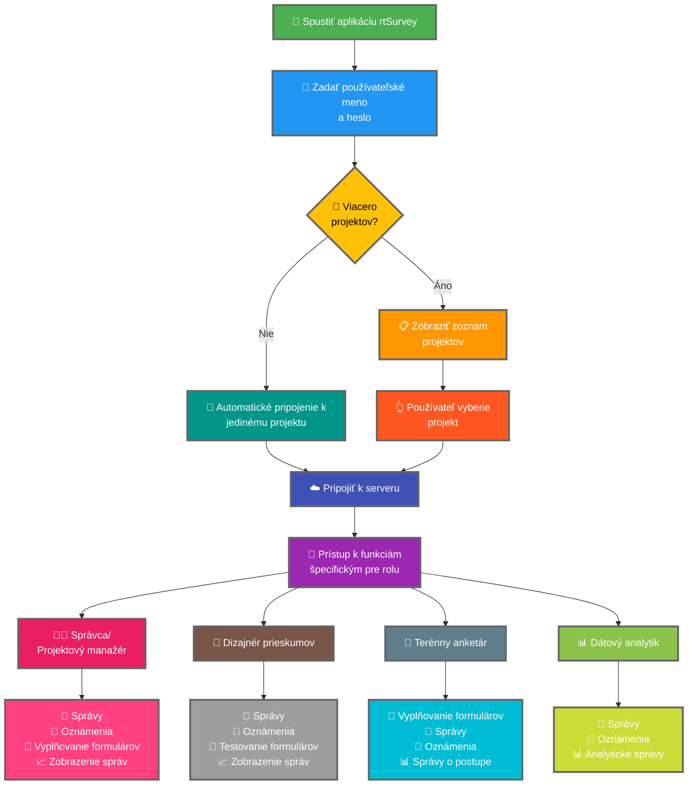

Pripojenie aplikácie rtSurvey k serveru je kľúčovým krokom na začatie používania aplikácie na zber dát, správu a analýzu. Tento proces zabezpečuje, že všetky roly prieskumu môžu pristupovať k potrebným funkciám a dátam v reálnom čase.

## Kľúčové rozdiely od ODK Collect

rtSurvey ponúka vylepšené funkcie v porovnaní s ODK Collect, uspokojujúce rôzne roly prieskumu:
- **Správca**: Správy, oznámenia o aktualizáciách (odoslanie dát, nové správy, nové účty), vyplňovanie formulárov a zobrazenie analytických správ.
- **Projektový manažér**: Podobné funkcie ako správcovia vrátane nastavenia a správy projektu.
- **Dizajnér prieskumov**: Správy, oznámenia, vyplňovanie formulárov a zobrazenie analytických správ.
- **Terénny anketár**: Vyplňovanie formulárov, správy, oznámenia a správy o postupe.
- **Dátový analytik**: Správy, oznámenia a prístup k analytickým správam.

## Kroky na pripojenie aplikácie rtSurvey k serveru

### 1. Uistite sa, že máte účet

Na pripojenie k serveru potrebujete účet. Účty môže vytvoriť správca alebo personál pomocou URL adresy na vytvorenie účtu nastavenej správcom.

### 2. Otvorte aplikáciu rtSurvey

Spustite aplikáciu rtSurvey na vašom mobilnom zariadení. Ak ste ju ešte nenainštalovali, pozrite si stránku [Inštalácia aplikácie rtSurvey](#installing-rtsurvey-app).

### 3. Prístup k nastaveniam pripojenia k serveru

1. Otvorte aplikáciu a prejdite do menu nastavení.
2. Vyberte možnosť pripojenia k serveru.

### 4. Zadajte údaje účtu a vyberte projekt

Pri pripájaní k rtSurvey je proces zefektívnený na základe konfigurácie vášho účtu:

- **Používateľské meno**: Zadajte používateľské meno vášho účtu.
- **Heslo**: Zadajte heslo vášho účtu.

Po zadaní prihlasovacích údajov:

- Ak je váš účet spojený iba s jedným prieskumným projektom:
  - Aplikácia vás automaticky prihlási na server tohto projektu.
  - Nemusíte zadávať URL servera ani manuálne vyberať projekt.

- Ak je váš účet spojený s viacerými prieskumnými projektmi:
  - Po úspešnej autentifikácii sa zobrazí zoznam projektov, ku ktorým máte prístup.
  - Vyberte projekt, na ktorom chcete pracovať, z tohto zoznamu.

### 5. Autentifikácia

Po zadaní podrobností servera klepnite na tlačidlo „Pripojiť" alebo „Prihlásiť". Aplikácia overí vaše prihlasovací údaje a nadviaže spojenie so serverom.

## Riešenie problémov s pripojením

Ak narazíte na problémy pri pripájaní k serveru:

1. **Skontrolujte internetové pripojenie**: Uistite sa, že vaše zariadenie je pripojené k internetu.
2. **Overte prihlasovacie údaje**: Uistite sa, že používateľské meno a heslo sú správne.
3. **Reštartujte aplikáciu**: Zatvorte a znovu otvorte aplikáciu rtSurvey.
4. **Kontaktujte podporu**: Ak problémy pretrvávajú, kontaktujte systémového správcu alebo podporu rtSurvey.

## Záver

Pripojenie aplikácie rtSurvey k serveru je priamy proces, ktorý vám umožní využiť plné možnosti aplikácie. Dodržaním vyššie uvedených krokov môžete zaistiť bezproblémový zber dát, správu a analýzu prispôsobenú vašej konkrétnej prieskumnej role.
