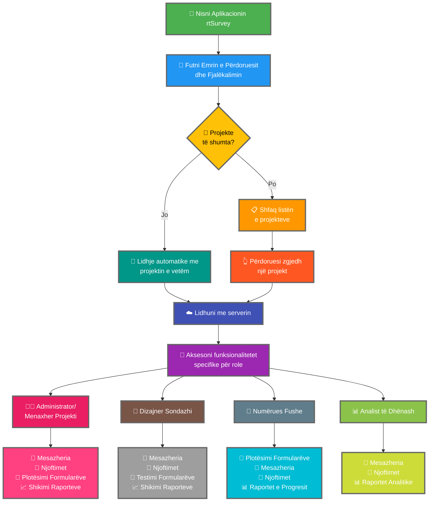

Lidhja e aplikacionit rtSurvey me një server është një hap vendimtar për të filluar përdorimin e aplikacionit për mbledhjen, menaxhimin dhe analizën e të dhënave. Ky proces siguron që të gjitha rolet e sondazhit mund të aksesojnë funksionalitetet dhe të dhënat e nevojshme në kohë reale.

## Ndryshimet Kryesore nga ODK Collect

rtSurvey ofron funksionalitete të zgjeruara krahasuar me ODK Collect, duke u kujdesur për role të ndryshme sondazhi:
- **Administratori**: Mesazheria, njoftimet për përditësimet (dorëzimi i të dhënave, raportet e reja, llogaritë e reja), plotësimi i formularëve dhe shikimi i raporteve analitike.
- **Menaxheri i Projektit**: Funksionalitete të ngjashme me Administratorët, duke përfshirë konfigurimin dhe menaxhimin e projekteve.
- **Dizajneri i Sondazhit**: Mesazheria, njoftimet, plotësimi i formularëve dhe shikimi i raporteve analitike.
- **Numëruesi i Fushës**: Plotësimi i formularëve, mesazheria, njoftimet dhe raportet e progresit.
- **Analisti i të Dhënave**: Mesazheria, njoftimet dhe aksesi në raportet analitike.

## Hapat për të Lidhur Aplikacionin rtSurvey me një Server

### 1. Sigurohuni që Keni një Llogari

Për t'u lidhur me serverin, keni nevojë për një llogari. Llogaritë mund të krijohen nga një Administrator ose nga stafi duke përdorur një URL të krijimit të llogarisë të konfiguruar nga Administratori.

### 2. Hapni Aplikacionin rtSurvey

Hapni aplikacionin rtSurvey në pajisjen tuaj celulare. Nëse nuk e keni instaluar ende, referojuni faqes [Instalimi i Aplikacionit rtSurvey](#installing-rtsurvey-app).

### 3. Aksesoni Cilësimet e Lidhjes me Serverin

1. Hapni aplikacionin dhe navigoni te menuja e cilësimeve.
2. Zgjidhni opsionin për t'u lidhur me një server.

### 4. Futni Detajet e Llogarisë dhe Zgjidhni Projektin

Kur lidheni me rtSurvey, procesi thjeshtësohet bazuar në konfigurimin e llogarisë suaj:

- **Emri i përdoruesit**: Futni emrin e përdoruesit të llogarisë suaj.
- **Fjalëkalimi**: Futni fjalëkalimin e llogarisë suaj.

Pas futjes së kredencialeve tuaja:

- Nëse llogaria juaj është e lidhur me vetëm një projekt sondazhi:
  - Aplikacioni do t'ju identifikojë automatikisht në serverin e atij projekti.
  - Nuk keni nevojë të futni URL-n e serverit ose të zgjidhni manualisht projektin.

- Nëse llogaria juaj është e lidhur me projekte të shumta sondazhi:
  - Pas autentifikimit të suksesshëm, do të shihni një listë projektesh ku keni akses.
  - Zgjidhni projektin ku dëshironi të punoni nga kjo listë.

### 5. Autentifikohuni

Pasi keni futur detajet e serverit, trokitni butonin "Lidhu" ose "Hyr". Aplikacioni do të autentifikojë kredencialet tuaja dhe do të krijojë një lidhje me serverin.

## Zgjidhja e Problemeve të Lidhjes

Nëse ndeshni probleme gjatë lidhjes me serverin:

1. **Kontrolloni Lidhjen me Internetin**: Sigurohuni që pajisja juaj është e lidhur me internetin.
2. **Konfirmoni Kredencialet**: Sigurohuni që emri i përdoruesit dhe fjalëkalimi janë korrekte.
3. **Rinisni Aplikacionin**: Mbyllni dhe rihapni aplikacionin rtSurvey.
4. **Kontaktoni Mbështetjen**: Nëse problemet vazhdojnë, kontaktoni administratorin e sistemit tuaj ose mbështetjen rtSurvey për asistencë.

## Përfundim

Lidhja e aplikacionit rtSurvey me një server është një proces i drejtpërdrejtë që ju mundëson të shfrytëzoni të gjitha aftësitë e aplikacionit. Duke ndjekur hapat e delineuar më sipër, mund të garantoni mbledhjen, menaxhimin dhe analizën e pandërprerë të të dhënave të personalizuara sipas rolit tuaj specifik të sondazhit.
