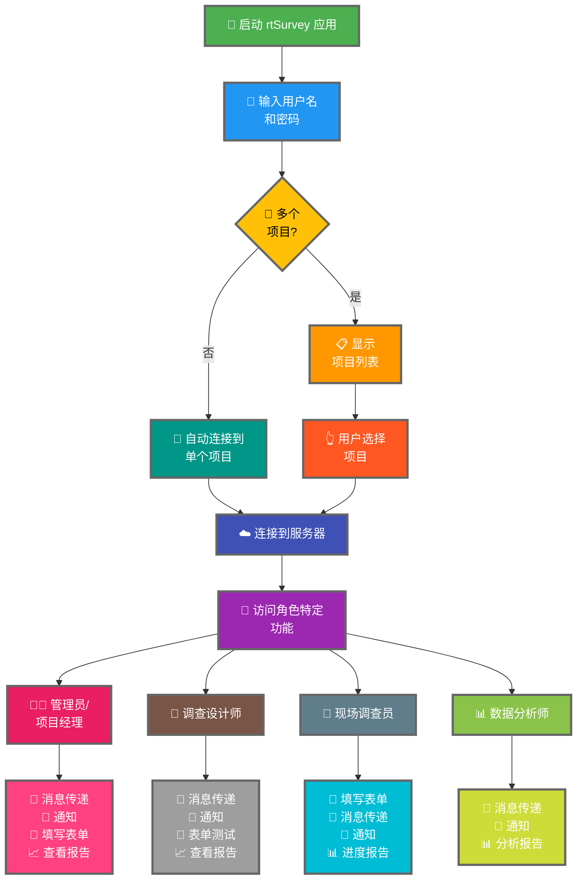

将 rtSurvey 应用连接到服务器是开始使用该应用进行数据收集、管理和分析的关键步骤。此过程确保所有调查角色都能实时访问必要的功能和数据。

## 与 ODK Collect 的主要区别

与 ODK Collect 相比，rtSurvey 为各种调查角色提供了增强功能：
- **管理员**：消息传递、更新通知（数据提交、新报告、新账户）、填写表单和查看分析报告。
- **项目经理**：与管理员类似的功能，包括项目设置和管理。
- **调查设计师**：消息传递、通知、填写表单和查看分析报告。
- **现场调查员**：填写表单、消息传递、通知和进度报告。
- **数据分析师**：消息传递、通知和访问分析报告。

## 将 rtSurvey 应用连接到服务器的步骤

### 1. 确保您有账户

要连接到服务器，您需要一个账户。账户可以由管理员创建，或者员工使用管理员设置的账户创建 URL 自行创建。

### 2. 打开 rtSurvey 应用

在您的移动设备上启动 rtSurvey 应用。如果尚未安装，请参阅[安装 rtSurvey 应用](#installing-rtsurvey-app)页面。

### 3. 访问服务器连接设置

1. 打开应用并导航到设置菜单。
2. 选择连接到服务器的选项。

### 4. 输入账户详情并选择项目

连接到 rtSurvey 时，流程根据您的账户配置而简化：

- **用户名**：输入您的账户用户名。
- **密码**：输入您的账户密码。

输入凭据后：

- 如果您的账户仅与一个调查项目关联：
  - 应用将自动登录到该项目的服务器。
  - 您无需手动输入服务器 URL 或选择项目。

- 如果您的账户与多个调查项目关联：
  - 成功验证后，您将看到您有权访问的项目列表。
  - 从列表中选择您要处理的项目。

### 5. 验证身份

输入服务器详情后，点击"连接"或"登录"按钮。应用将验证您的凭据并建立与服务器的连接。

## 连接问题故障排除

如果连接服务器时遇到问题：

1. **检查网络连接**：确保您的设备已连接到互联网。
2. **确认凭据**：确保您的用户名和密码正确。
3. **重启应用**：关闭并重新打开 rtSurvey 应用。
4. **联系支持**：如果问题仍然存在，请联系您的系统管理员或 rtSurvey 支持寻求帮助。

## 结论

将 rtSurvey 应用连接到服务器是一个简单的过程，使您能够充分利用该应用的所有功能。按照上述步骤，您可以确保针对您特定调查角色定制的无缝数据收集、管理和分析。
